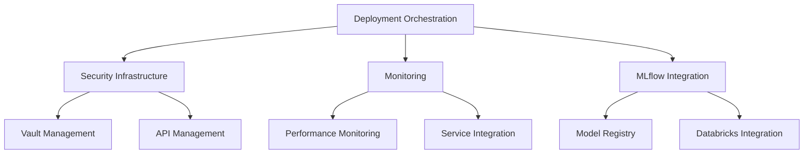
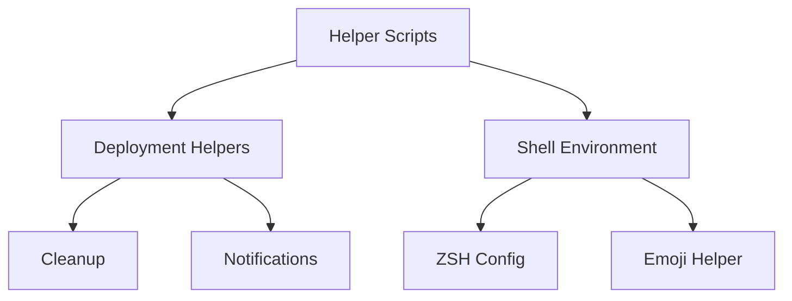

# Comprehensive Analysis of Aeon Nova Deployment Scripts
# Security Level: Confidential
# Version: 1.0
# Last Modified: 2025-01-14

## BLUF (Bottom Line Up Front)
Detailed analysis of deployment, configuration, and automation scripts for the Aeon Nova Framework, organized by functional categories with dependency tracking and versioning information.

## 1. Core Deployment Orchestration

### 1.1 Primary Deployment Scripts
| File | Version | Status | Dependencies |
|------|---------|--------|--------------|
| `250110_DEPLOY_ORCHESTRATE_INT_v2.0_ANFL.sh` | 2.0 | Active | Vault, K8s, monitoring |
| `240112_DEPLOY_ORCHESTRATE_INT_v2.1_ANFL.sh` | 2.1 | Active | Enhanced orchestration |

Key Features:
- Quantum-secure deployment verification
- Multi-region orchestration
- Blockchain-verified operations
- Automated rollback procedures
- Enhanced monitoring integration

Critical Functions:
```bash
# Main deployment sequence
setup_security_components()
setup_infrastructure_components()
setup_monitoring_stack()
deploy_components()
validate_deployment_all()
```

### 1.2 Environment Initialization
| File | Version | Status | Dependencies |
|------|---------|--------|--------------|
| `250112_ENV_INIT_INT_v1.4_ANFL.sh` | 1.4 | Active | Vault, Grafana |
| `241231_LOCAL_INIT_INT_v1.1_ANFL.py` | 1.1 | Active | Local dev environment |

Key Capabilities:
- Environment validation
- Vault configuration
- Monitoring setup
- Resource quota management

## 2. Security Infrastructure

### 2.1 Vault Management
| File | Version | Status | Purpose |
|------|---------|--------|---------|
| `250113_VAULT_AUTO_INT_v1.0_ANFL.sh` | 1.0 | Active | Automated setup |
| `250113_VAULT_CONFIG_INT_v1.0_ANFL.sh` | 1.0 | Active | Configuration |
| `250113_VAULT_SETUP_INT_v1.0_ANFL.sh` | 1.0 | Active | Initial setup |
| `250113_VAULT_UNSEAL_INT_v1.0_ANFL.sh` | 1.0 | Active | Unseal process |

Security Features:
- Quantum-secure key generation
- Automated key rotation
- Blockchain verification
- Policy management
- Audit logging

### 2.2 API Management
| File | Version | Status | Purpose |
|------|---------|--------|---------|
| `250109_API_KEY_MANAGER_INT_v1.0_ANFL.py` | 1.0 | Active | Secure key management |

Core Functions:
```python
async def create_api_key()
async def rotate_api_key()
async def verify_api_key()
async def update_key_references()
```

## 3. Monitoring and Performance

### 3.1 Core Monitoring
| File | Version | Status | Purpose |
|------|---------|--------|---------|
| `250110_DEPLOY_MONITOR_INT_v1.0_ANFL.py` | 1.0 | Active | Deployment monitoring |
| `250109_PERF_TEST_INT_v1.0_ANFL.py` | 1.0 | Active | Performance testing |

Monitoring Capabilities:
- Real-time deployment tracking
- Performance metrics collection
- Resource utilization monitoring
- Alert management

### 3.2 Integration Monitoring
| File | Version | Status | Purpose |
|------|---------|--------|---------|
| `250109_SERVICE_INTEGRATION_INT_v1.0_ANFL.py` | 1.0 | Active | Service monitoring |
| `250110_ENV_VALIDATE_INT_v1.0_ANFL.py` | 1.0 | Active | Environment validation |

Key Features:
- Service health checks
- Integration validation
- Cross-component monitoring
- Security verification

## 4. MLflow Integration

### 4.1 Core MLflow Components
| File | Version | Status | Purpose |
|------|---------|--------|---------|
| `250109_MLFLOW_CONFIG_INT_v1.0_ANFL.py` | 1.0 | Active | MLflow configuration |
| `250109_MLFLOW_DATABRICKS_INT_v1.0_ANFL.py` | 1.0 | Active | Databricks integration |

Integration Features:
- Secure model registry
- Quantum-secure artifact storage
- Automated model tracking
- Deployment verification

## 5. Helper Scripts

### 5.1 Deployment Helpers
| File | Version | Status | Purpose |
|------|---------|--------|---------|
| `250112_DEPLOY_HELPER_INT_v1.0_ANFL.sh` | 1.0 | Active | Deployment automation |
| `250112_CLEANUP_HELPER_INT_v1.0_ANFL.sh` | 1.0 | Active | Resource cleanup |
| `250112_NOTIFY_HELPER_INT_v1.0_ANFL.sh` | 1.0 | Active | Notifications |

Core Functions:
- Automated cleanup
- Error handling
- Notification management
- Resource optimization

### 5.2 Shell Environment
| File | Version | Status | Purpose |
|------|---------|--------|---------|
| `250113_ZSH_CONFIG_INT_v1.0_ANFL.py` | 1.0 | Active | ZSH configuration |
| `250113_EMOJI_HELPER_EXT_v1.0_ANFL.py` | 1.0 | Active | Enhanced UI |

Environment Features:
- Enhanced shell integration
- Custom prompt configuration
- Automated environment setup
- Visual feedback helpers

## 6. Dependencies and Relationships

### 6.1 Primary Dependencies


### 6.2 Secondary Dependencies


## 7. Cleanup Recommendations

### 7.1 Files to Remove
1. `Untitled.*` files (4 files)
2. `250110_DEPLOY_ORCHESTRATE_INT_v1.0_ANFL.sh`
3. `250110_ENV_INIT_INT_v1.3_ANFL.sh`
4. `helm-deployment-plan.sh`
5. `deployment-fix-v2.sh`
6. `250112_SETUP_ENV_ARCHIVE_INT_v1.0_ANFL.sh`

### 7.2 Critical Files to Retain
1. Core Deployment Scripts:
   - `250110_DEPLOY_ORCHESTRATE_INT_v2.0_ANFL.sh`
   - `240112_DEPLOY_ORCHESTRATE_INT_v2.1_ANFL.sh`
   - `250112_ENV_INIT_INT_v1.4_ANFL.sh`

2. Security Infrastructure:
   - All `250113_VAULT_*` scripts
   - `250109_API_KEY_MANAGER_INT_v1.0_ANFL.py`

3. Monitoring and Integration:
   - `250110_DEPLOY_MONITOR_INT_v1.0_ANFL.py`
   - `250109_SERVICE_INTEGRATION_INT_v1.0_ANFL.py`
   - `250109_PERF_TEST_INT_v1.0_ANFL.py`

4. MLflow Components:
   - `250109_MLFLOW_CONFIG_INT_v1.0_ANFL.py`
   - `250109_MLFLOW_DATABRICKS_INT_v1.0_ANFL.py`

## 8. Version Control Status

### 8.1 Current Active Versions
- Deployment Orchestration: v2.1
- Environment Init: v1.4
- Vault Management: v1.0
- MLflow Integration: v1.0
- Monitoring Components: v1.0

### 8.2 Version History
Major changes tracked through the ANFL versioning system with active development continuing in v1.0 components while established components have reached v2.0+.

## 9. Documentation Standards

All scripts follow the Aeon Nova Framework documentation standards:
- File headers with comprehensive metadata
- BLUF statements for quick reference
- Clear dependency documentation
- Version control integration
- Security level indicators

## Version History

| Version | Date | Changes |
|---------|------|---------|
| 1.0 | 2025-01-14 | Initial comprehensive analysis |
