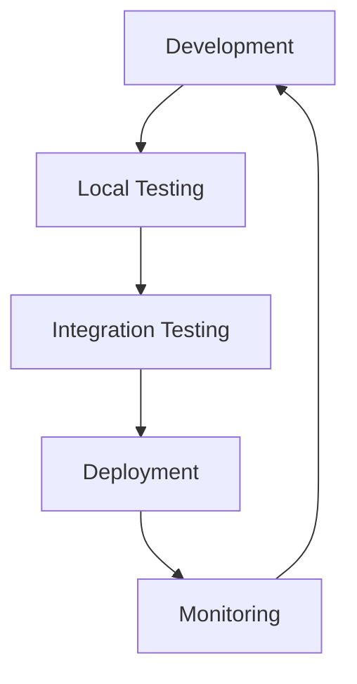
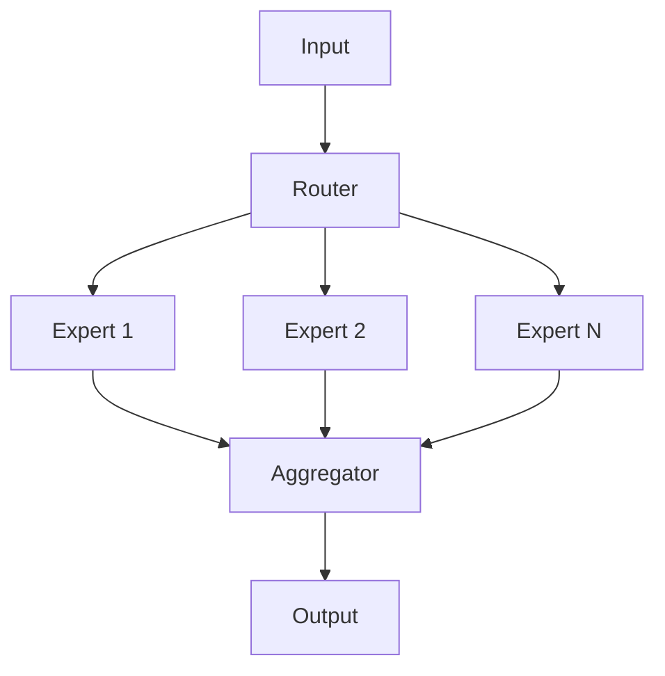
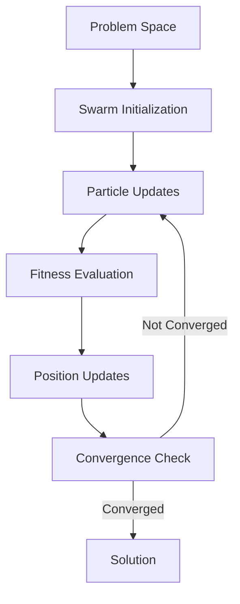

# ----------------------------------------------------------------------------
# File: 250208_ARCHITECTURE_INT_v1.0_ANFL.md
# Location: /Volumes/mattstack/VSCode/AeonNovaFutureLabs/docs/
#
# Purpose: Architecture insights and integration patterns from reference projects
# Security Level: Confidential
# Owner: Infrastructure Team
# Version: 1.0
# Last Modified: 2025-02-08
#
# References:
# - ezlocalai (https://github.com/DevXT-LLC/ezlocalai)
# - AGiXT (https://github.com/Josh-XT/AGiXT)
# - DSPy (https://github.com/stanfordnlp/dspy)
# - E2B (https://github.com/e2b-dev/E2B)
# - swarms-pytorch (https://github.com/kyegomez/swarms-pytorch)
# ----------------------------------------------------------------------------

# BLUF: Key architectural patterns and integration strategies from reference projects

## Architectural Insights

### 1. From EZLocalAI
- Modular component structure with clear separation of concerns
- Efficient model management and loading system
- Local AI deployment patterns
- Docker-based deployment strategy

### 2. From AGiXT
- Plugin-based architecture for extensibility
- Robust command and instruction management
- Memory and context management patterns
- Multi-provider support architecture

### 3. From DSPy
- Programming-first approach to AI development
- Structured module compilation
- Efficient prompt management
- Modular testing framework

### 4. From E2B
- Secure runtime environment patterns
- Cloud-native architecture design
- Agent development frameworks
- TypeScript/Python interoperability

### 5. From Swarms-PyTorch
- Mixture of Experts (MoE) implementation
- Swarm optimization algorithms
- Multi-modal deep learning integration
- Distributed training patterns

## Integration Strategies

### 1. Core Architecture
- Adopt AGiXT's plugin system for extensibility
- Use DSPy's programming model for AI interactions
- Implement E2B's security patterns
- Follow EZLocalAI's modular component structure
- Integrate Swarms-PyTorch's MoE architecture

### 2. Development Workflow


### 3. Component Organization
```
ai_components/
├── core/           # Core framework components
├── models/         # Model definitions and handlers
│   ├── moe/       # Mixture of Experts implementation
│   └── swarm/     # Swarm algorithm implementations
├── vector_store/   # Vector storage system
├── orchestrator/   # Task orchestration
└── utils/         # Utility functions
```

### 4. Security Implementation
- E2B-style runtime isolation
- AGiXT-style permission management
- Vault integration for secrets
- Comprehensive audit logging

### 5. Monitoring and Metrics
- Prometheus/Grafana integration
- Custom AI metrics collection
- Performance tracking
- Resource utilization monitoring

### 6. AI Architecture

#### Mixture of Experts (MoE)
- Dynamic expert routing system
- Load-balanced expert allocation
- Specialized expert implementations
- Expert performance monitoring

#### Swarm Optimization
- Particle Swarm Optimization (PSO)
- Ant Colony algorithms
- Sakana implementation
- Swarm intelligence patterns

## Implementation Priorities

1. Core Framework
   - Base infrastructure setup
   - Security framework implementation
   - Monitoring system integration
   - Configuration management

2. AI Components
   - MoE system implementation
   - Swarm algorithm integration
   - Vector store implementation
   - Memory management

3. Development Tools
   - CLI tools
   - Development environment
   - Testing framework
   - Documentation system

4. Deployment System
   - Container orchestration
   - Resource management
   - Scaling system
   - Health monitoring

## Best Practices

1. Code Organization
   - Follow ANFL style guide
   - Implement comprehensive testing
   - Maintain clear documentation
   - Use type hints and validation

2. Security
   - Implement least privilege access
   - Regular security audits
   - Secure configuration management
   - Comprehensive logging

3. Performance
   - Efficient resource utilization
   - Caching strategies
   - Asynchronous operations
   - Load balancing

4. Monitoring
   - Real-time metrics
   - Alert system
   - Performance tracking
   - Resource monitoring

## AI System Design

### 1. MoE Architecture


### 2. Swarm Integration


## Future Considerations

1. Scalability
   - Horizontal scaling capabilities
   - Load distribution
   - Resource optimization
   - Performance tuning

2. Integration
   - External API support
   - Plugin system expansion
   - Third-party integrations
   - Custom extensions

3. Advanced Features
   - Advanced AI capabilities
   - Enhanced security features
   - Custom model support
   - Specialized tools

## Maintenance and Updates

1. Regular Tasks
   - Security updates
   - Dependency management
   - Performance optimization
   - Documentation updates

2. Monitoring
   - System health checks
   - Performance metrics
   - Security audits
   - Usage analytics

3. Improvements
   - Feature enhancements
   - Bug fixes
   - Performance optimization
   - Security hardening