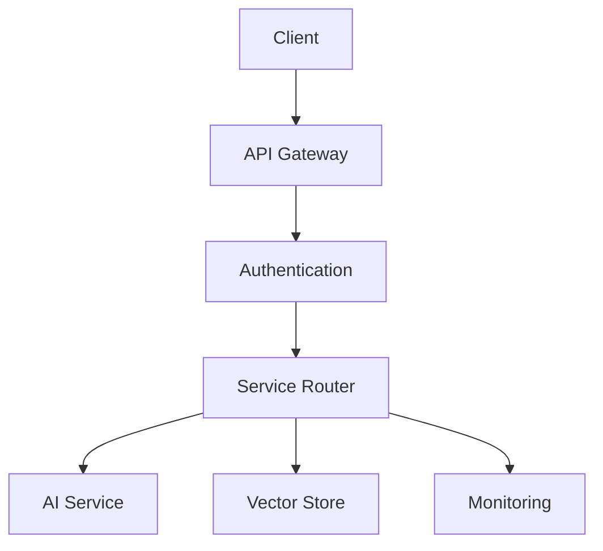
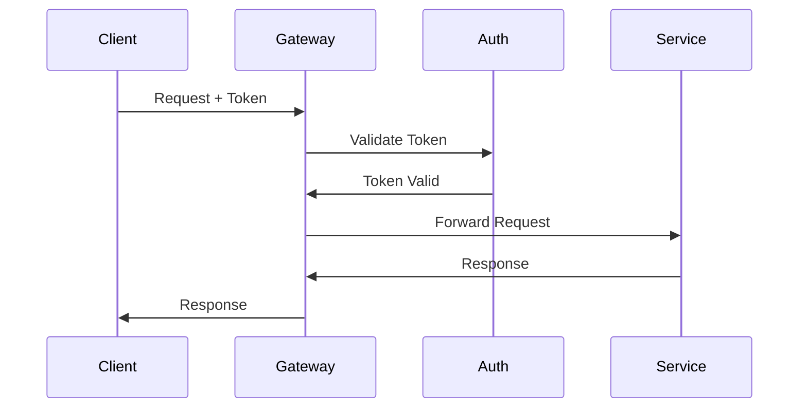

# ----------------------------------------------------------------------------
# File: 250208_API_GUIDE_INT_v1.0_ANFL.md
# Location: /Volumes/mattstack/VSCode/AeonNovaFutureLabs/docs/api/
#
# Purpose: API interface and integration documentation
# Security Level: Confidential
# Owner: Infrastructure Team
# Version: 1.0
# Last Modified: 2025-02-08
#
# References:
# - 250208_ARCH_OVERVIEW_INT_v1.0_ANFL.md
# - ai_components/models/base_integration.py
# ----------------------------------------------------------------------------

# BLUF: API interface and integration documentation for ANFL framework

## API Architecture

### 1. Core Components


### 2. Authentication Flow


## API Endpoints

### 1. AI Services

#### Model Inference
```python
# POST /api/v1/ai/inference
{
    "method": "POST",
    "path": "/api/v1/ai/inference",
    "description": "Perform model inference",
    "parameters": {
        "model_id": "string",
        "input_data": "object",
        "parameters": "object"
    },
    "responses": {
        "200": {
            "description": "Successful inference",
            "schema": {
                "prediction": "object",
                "confidence": "number",
                "latency": "number"
            }
        }
    }
}
```

#### Model Management
```python
# GET /api/v1/ai/models
{
    "method": "GET",
    "path": "/api/v1/ai/models",
    "description": "List available models",
    "parameters": {
        "type": "string",
        "status": "string",
        "limit": "number"
    }
}

# POST /api/v1/ai/models
{
    "method": "POST",
    "path": "/api/v1/ai/models",
    "description": "Register new model",
    "parameters": {
        "name": "string",
        "type": "string",
        "version": "string",
        "artifacts": "object"
    }
}
```

### 2. Vector Store

#### Vector Operations
```python
# POST /api/v1/vectors/search
{
    "method": "POST",
    "path": "/api/v1/vectors/search",
    "description": "Search vector store",
    "parameters": {
        "query_vector": "array",
        "top_k": "number",
        "filters": "object"
    }
}

# POST /api/v1/vectors/upsert
{
    "method": "POST",
    "path": "/api/v1/vectors/upsert",
    "description": "Insert or update vectors",
    "parameters": {
        "vectors": "array",
        "metadata": "object"
    }
}
```

### 3. Monitoring

#### Metrics
```python
# GET /api/v1/metrics
{
    "method": "GET",
    "path": "/api/v1/metrics",
    "description": "Get system metrics",
    "parameters": {
        "type": "string",
        "from": "timestamp",
        "to": "timestamp"
    }
}
```

## Authentication

### 1. Token Management
```python
# POST /api/v1/auth/token
{
    "method": "POST",
    "path": "/api/v1/auth/token",
    "description": "Generate access token",
    "parameters": {
        "client_id": "string",
        "client_secret": "string",
        "scope": "string"
    }
}
```

### 2. Access Control
```python
def authenticate_request(request):
    # Validate token
    token = extract_token(request)
    claims = validate_token(token)
    
    # Check permissions
    verify_permissions(claims)
    
    # Audit access
    audit_access(claims)
```

## Integration Examples

### 1. Python Client
```python
from anfl_client import ANFL

# Initialize client
client = ANFL(
    api_key="your-api-key",
    endpoint="https://api.anfl.ai"
)

# Perform inference
response = client.ai.inference(
    model_id="model-123",
    input_data={"text": "Hello, AI!"}
)

# Search vectors
results = client.vectors.search(
    query_vector=[0.1, 0.2, 0.3],
    top_k=10
)
```

### 2. JavaScript Client
```javascript
import { ANFL } from '@anfl/client';

// Initialize client
const client = new ANFL({
    apiKey: 'your-api-key',
    endpoint: 'https://api.anfl.ai'
});

// Perform inference
const response = await client.ai.inference({
    modelId: 'model-123',
    inputData: { text: 'Hello, AI!' }
});

// Search vectors
const results = await client.vectors.search({
    queryVector: [0.1, 0.2, 0.3],
    topK: 10
});
```

## Error Handling

### 1. Error Codes
```python
ERROR_CODES = {
    "AUTH_001": "Invalid authentication",
    "AUTH_002": "Insufficient permissions",
    "AI_001": "Model not found",
    "AI_002": "Invalid input format",
    "VEC_001": "Vector dimension mismatch",
    "VEC_002": "Index not found"
}
```

### 2. Error Responses
```python
{
    "error": {
        "code": "AI_001",
        "message": "Model not found",
        "details": {
            "model_id": "model-123",
            "timestamp": "2025-02-08T12:00:00Z"
        }
    }
}
```

## Rate Limiting

### 1. Limits
```python
RATE_LIMITS = {
    "default": {
        "requests": 1000,
        "period": "hour"
    },
    "inference": {
        "requests": 100,
        "period": "minute"
    }
}
```

### 2. Headers
```http
X-RateLimit-Limit: 1000
X-RateLimit-Remaining: 995
X-RateLimit-Reset: 1628450400
```

## Best Practices

### 1. API Usage
- Use authentication
- Handle errors
- Implement retries
- Monitor usage
- Cache responses

### 2. Integration
- Version control
- Error handling
- Logging
- Monitoring
- Documentation

### 3. Security
- Secure tokens
- Validate input
- Sanitize output
- Audit access
- Monitor usage

## References

### Documentation
- Architecture Guide
- Security Guide
- Development Guide
- Integration Guide

### Tools
- API Tools
- Client SDKs
- Testing Tools
- Debug Tools

## Support

For API issues:
1. Check documentation
2. Review logs
3. Contact API team

## License
Confidential and proprietary. All rights reserved.

---
© 2025 Aeon Nova Future Labs. All rights reserved.