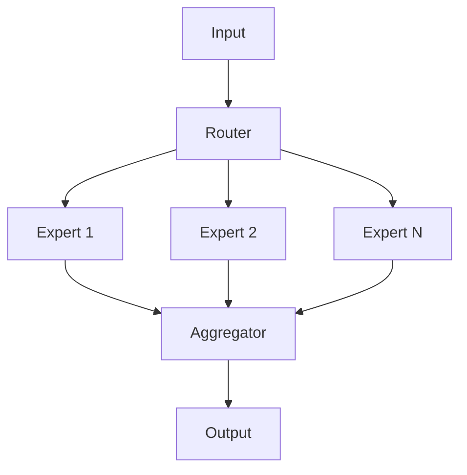
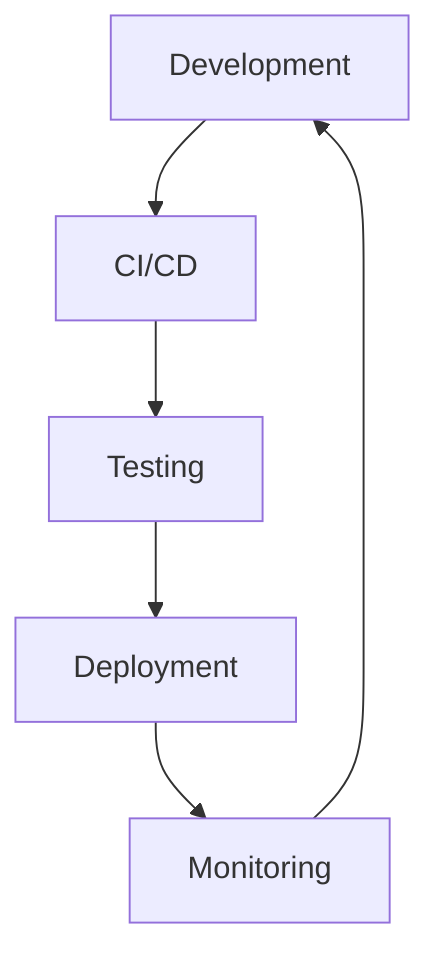
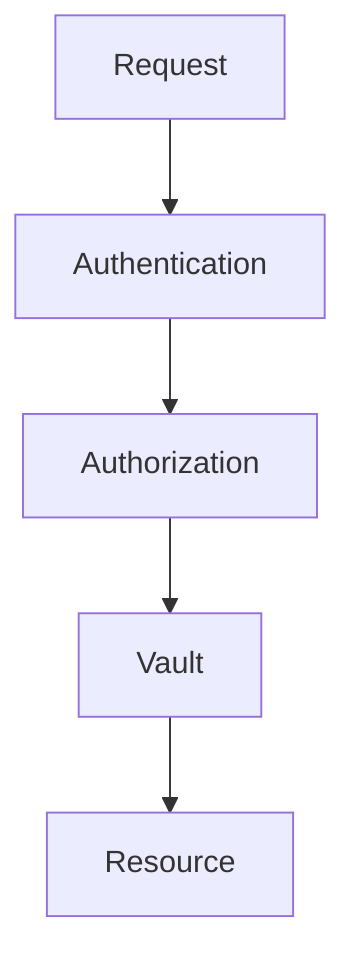

# ----------------------------------------------------------------------------
# File: 250208_ARCH_OVERVIEW_INT_v1.0_ANFL.md
# Location: /Volumes/mattstack/VSCode/AeonNovaFutureLabs/docs/architecture/
#
# Purpose: Core architecture overview and design principles
# Security Level: Confidential
# Owner: Infrastructure Team
# Version: 1.0
# Last Modified: 2025-02-08
#
# References:
# - 250208_ARCHITECTURE_INT_v1.0_ANFL.md
# - 250208_AI_METRICS_INT_v1.0_ANFL.yaml
# ----------------------------------------------------------------------------

# BLUF: Core architecture overview and design principles for ANFL framework

## System Overview

### Core Components

1. AI Components
   - Mixture of Experts (MoE) System
   - Swarm Optimization Algorithms
   - Vector Store Integration
   - Model Management

2. Infrastructure
   - Monitoring Stack
   - Deployment System
   - Security Framework
   - Vault Integration

3. Development Tools
   - Shell Framework
   - Testing Infrastructure
   - Documentation System
   - CI/CD Pipeline

## Architecture Principles

### 1. Modularity
- Clear component boundaries
- Loose coupling
- High cohesion
- Pluggable architecture

### 2. Security
- Zero-trust architecture
- Secure by default
- Comprehensive auditing
- Vault integration

### 3. Scalability
- Horizontal scaling
- Load balancing
- Resource optimization
- Performance monitoring

### 4. Maintainability
- Clear documentation
- Consistent style
- Automated testing
- Version control

## Component Architecture

### 1. AI System

### 2. Infrastructure

### 3. Security

## Implementation Details

### 1. AI Components

#### MoE System
- Dynamic routing
- Expert specialization
- Load balancing
- Performance monitoring

#### Swarm Optimization
- PSO implementation
- Ant Colony algorithms
- Sakana integration
- Optimization metrics

### 2. Infrastructure

#### Monitoring
- Prometheus metrics
- Grafana dashboards
- Alert management
- Performance tracking

#### Deployment
- Docker containers
- Kubernetes orchestration
- Rolling updates
- Health checks

### 3. Development

#### Shell Framework
- Modular components
- Error handling
- Logging system
- Utility functions

#### Testing
- Unit tests
- Integration tests
- Performance tests
- Coverage metrics

## Best Practices

### 1. Code Organization
- Follow ANFL style guide
- Use consistent naming
- Maintain documentation
- Implement testing

### 2. Security
- Regular audits
- Access control
- Secure communication
- Data protection

### 3. Performance
- Resource monitoring
- Optimization
- Caching strategies
- Load testing

### 4. Development
- Code reviews
- Documentation
- Testing
- Version control

## Future Considerations

### 1. Scalability
- Cluster expansion
- Load distribution
- Resource management
- Performance tuning

### 2. Integration
- External APIs
- Third-party services
- Custom extensions
- Plugin system

### 3. Advanced Features
- Enhanced AI capabilities
- Security improvements
- Custom tooling
- Automation

## References

### Documentation
- Architecture Guide
- Security Guide
- Development Guide
- API Documentation

### Related Components
- AI Components
- Infrastructure
- Monitoring
- Development Tools

## Support

For issues and support:
1. Check documentation
2. Review logs
3. Contact infrastructure team

## License
Confidential and proprietary. All rights reserved.

---
© 2025 Aeon Nova Future Labs. All rights reserved.