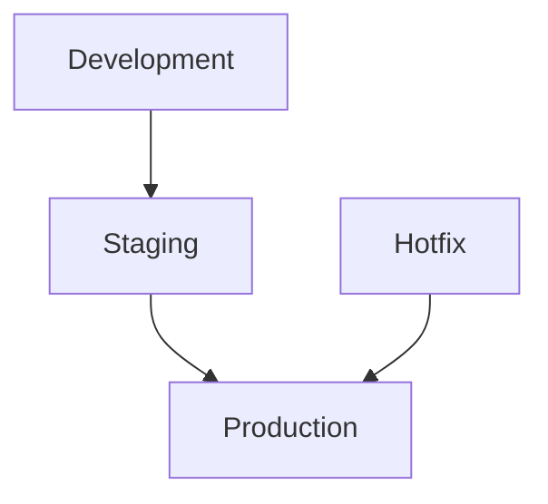
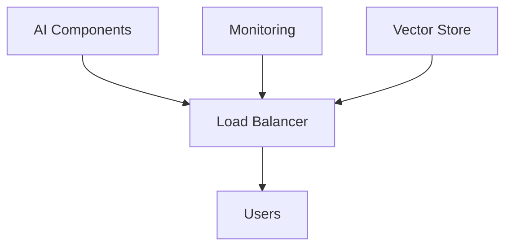

# ----------------------------------------------------------------------------
# File: 250208_DEPLOY_GUIDE_INT_v1.0_ANFL.md
# Location: /Volumes/mattstack/VSCode/AeonNovaFutureLabs/docs/deployment/
#
# Purpose: Deployment procedures and guidelines documentation
# Security Level: Confidential
# Owner: Infrastructure Team
# Version: 1.0
# Last Modified: 2025-02-08
#
# References:
# - 250208_ARCH_OVERVIEW_INT_v1.0_ANFL.md
# - 250208_DEPLOY_HANDLER_INT_v1.0_ANFL.zsh
# ----------------------------------------------------------------------------

# BLUF: Deployment procedures and guidelines for ANFL framework

## Deployment Architecture

### 1. Environment Structure


### 2. Component Structure


## Deployment Process

### 1. Pre-deployment
```bash
# Verify environment
anfl-status

# Run tests
anfl-test

# Check security
anfl-secure

# Verify monitoring
anfl-monitor
```

### 2. Deployment Steps
```bash
# Deploy component
anfl-deploy <component> <environment>

# Verify deployment
anfl-status

# Check logs
anfl-logs deployment
```

## Component Deployment

### 1. AI Components
```yaml
# AI deployment configuration
components:
  moe:
    image: anfl/moe:latest
    replicas: 3
    resources:
      cpu: 2
      memory: 4Gi
  
  swarm:
    image: anfl/swarm:latest
    replicas: 2
    resources:
      cpu: 1
      memory: 2Gi
```

### 2. Monitoring Stack
```yaml
# Monitoring deployment
components:
  prometheus:
    image: prom/prometheus:latest
    config: prometheus.yml
    storage: 30d
  
  grafana:
    image: grafana/grafana:latest
    config: grafana.ini
    persistence: true
```

### 3. Vector Store
```yaml
# Vector store deployment
components:
  vector_store:
    image: anfl/vector-store:latest
    replicas: 3
    storage:
      size: 100Gi
      class: fast
```

## Environment Configuration

### 1. Development
```yaml
environment:
  name: development
  debug: true
  logging: debug
  monitoring: basic
  resources: minimal
```

### 2. Staging
```yaml
environment:
  name: staging
  debug: false
  logging: info
  monitoring: full
  resources: moderate
```

### 3. Production
```yaml
environment:
  name: production
  debug: false
  logging: warn
  monitoring: full
  resources: optimal
```

## Deployment Validation

### 1. Health Checks
```python
def validate_deployment():
    # Check component health
    check_component_health()
    
    # Verify connectivity
    verify_connectivity()
    
    # Check resources
    verify_resources()
    
    # Monitor metrics
    check_metrics()
```

### 2. Performance Tests
```python
def performance_validation():
    # Load testing
    run_load_tests()
    
    # Stress testing
    run_stress_tests()
    
    # Capacity testing
    check_capacity()
```

## Rollback Procedures

### 1. Automatic Rollback
```bash
# Trigger rollback
anfl-deploy rollback <component> <version>

# Verify rollback
anfl-status

# Check system health
anfl-monitor health
```

### 2. Manual Rollback
```bash
# Stop current version
anfl-deploy stop <component>

# Deploy previous version
anfl-deploy <component> <previous-version>

# Verify deployment
anfl-status
```

## Monitoring & Alerts

### 1. Deployment Metrics
```yaml
metrics:
  deployment:
    - deployment_time
    - success_rate
    - error_count
    - resource_usage
```

### 2. Alert Configuration
```yaml
alerts:
  deployment:
    - name: DeploymentFailed
      condition: status != success
      severity: critical
    
    - name: HighResourceUsage
      condition: usage > 90%
      severity: warning
```

## Best Practices

### 1. Deployment Planning
- Version control
- Change management
- Risk assessment
- Rollback planning
- Communication plan

### 2. Security
- Access control
- Secret management
- Network security
- Audit logging
- Compliance checks

### 3. Performance
- Resource planning
- Load balancing
- Scaling strategy
- Monitoring setup
- Backup strategy

## Troubleshooting

### 1. Common Issues
- Resource constraints
- Configuration errors
- Network issues
- Permission problems
- Integration failures

### 2. Debug Process
```bash
# Check deployment logs
anfl-logs deployment

# Verify configurations
anfl-verify config

# Check connectivity
anfl-test connectivity

# Verify resources
anfl-status resources
```

## References

### Documentation
- Architecture Guide
- Security Guide
- Monitoring Guide
- Operations Guide

### Tools
- Deployment Tools
- Monitoring System
- Security Tools
- Debug Tools

## Support

For deployment issues:
1. Check documentation
2. Review logs
3. Contact infrastructure team

## License
Confidential and proprietary. All rights reserved.

---
© 2025 Aeon Nova Future Labs. All rights reserved.