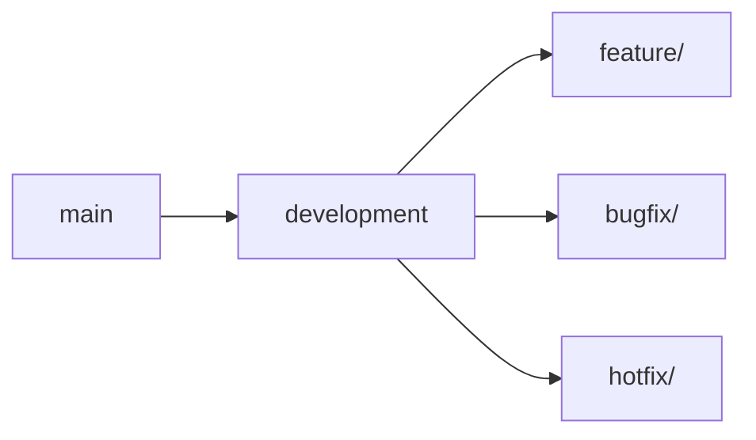

# ----------------------------------------------------------------------------
# File: 250208_DEV_GUIDE_INT_v1.0_ANFL.md
# Location: /Volumes/mattstack/VSCode/AeonNovaFutureLabs/docs/development/
#
# Purpose: Development guidelines and workflow documentation
# Security Level: Confidential
# Owner: Infrastructure Team
# Version: 1.0
# Last Modified: 2025-02-08
#
# References:
# - 250208_ARCH_OVERVIEW_INT_v1.0_ANFL.md
# - anfl_style_guide.xml
# ----------------------------------------------------------------------------

# BLUF: Development guidelines and workflow for ANFL framework

## Development Environment

### 1. Prerequisites
- Python 3.8+
- Docker & Docker Compose
- Node.js 18+
- Vault
- Git

### 2. Setup
```bash
# Clone repository
git clone https://github.com/AeonNovaFutureLabs/AeonNovaFutureLabs.git

# Initialize environment
cd AeonNovaFutureLabs
source .zshrc

# Create Python environment
anfl-dev
python -m venv venv
source venv/bin/activate
pip install -r requirements.txt
```

## Development Workflow

### 1. Branch Strategy


### 2. Commit Convention
```
<type>(<scope>): <subject>

<body>

<footer>
```

Types:
- feat: New feature
- fix: Bug fix
- docs: Documentation
- style: Formatting
- refactor: Code restructuring
- test: Testing
- chore: Maintenance

### 3. Code Review Process
1. Create feature branch
2. Implement changes
3. Run tests
4. Create pull request
5. Code review
6. Address feedback
7. Merge

## Code Standards

### 1. Python
- Black formatting
- isort imports
- mypy type checking
- pylint linting
- 88 character line length
- Google docstring style

### 2. Shell Scripts
- shellcheck validation
- 80 character line length
- Function documentation
- Error handling
- Strict mode

### 3. Documentation
- Clear BLUF
- Consistent headers
- Version tracking
- Reference linking
- Security level

## Testing

### 1. Unit Tests
```python
def test_example():
    # Arrange
    data = setup_test_data()
    
    # Act
    result = process_data(data)
    
    # Assert
    assert result.status == "success"
```

### 2. Integration Tests
```python
@pytest.mark.integration
def test_integration():
    # Setup
    system = setup_test_system()
    
    # Execute
    result = system.process()
    
    # Verify
    verify_system_state(result)
```

### 3. Performance Tests
```python
@pytest.mark.performance
def test_performance():
    # Setup
    data = generate_large_dataset()
    
    # Measure
    with timer() as t:
        result = process_data(data)
    
    # Assert
    assert t.duration < MAX_DURATION
```

## Tools & Utilities

### 1. Development Commands
```bash
# Start development environment
anfl-dev

# Run tests
anfl-test

# Format code
anfl-lint

# Check security
anfl-secure
```

### 2. Monitoring
```bash
# View logs
anfl-logs

# Check metrics
anfl-metrics

# View dashboard
anfl-grafana
```

### 3. Deployment
```bash
# Deploy component
anfl-deploy <component> <environment>

# Check status
anfl-status

# View deployment logs
anfl-logs deployment
```

## Best Practices

### 1. Code Organization
- Clear module structure
- Consistent naming
- Proper documentation
- Type hints
- Error handling

### 2. Testing
- High coverage
- Clear test cases
- Proper mocking
- Performance tests
- Integration tests

### 3. Security
- Secure coding
- Input validation
- Secret management
- Access control
- Audit logging

### 4. Performance
- Profiling
- Optimization
- Caching
- Resource management
- Load testing

## Troubleshooting

### 1. Common Issues
- Environment setup
- Dependency conflicts
- Permission errors
- Resource limits
- Network issues

### 2. Debug Tools
```bash
# Enable debug mode
export ANFL_DEBUG=1

# Enable trace mode
export ANFL_TRACE=1

# View debug logs
tail -f $ANFL_LOGS/debug.log
```

### 3. Support
1. Check documentation
2. Review logs
3. Contact infrastructure team

## References

### Documentation
- Architecture Guide
- API Documentation
- Style Guide
- Security Guide

### Tools
- Development Tools
- Testing Framework
- Monitoring System
- Deployment Tools

## License
Confidential and proprietary. All rights reserved.

---
© 2025 Aeon Nova Future Labs. All rights reserved.