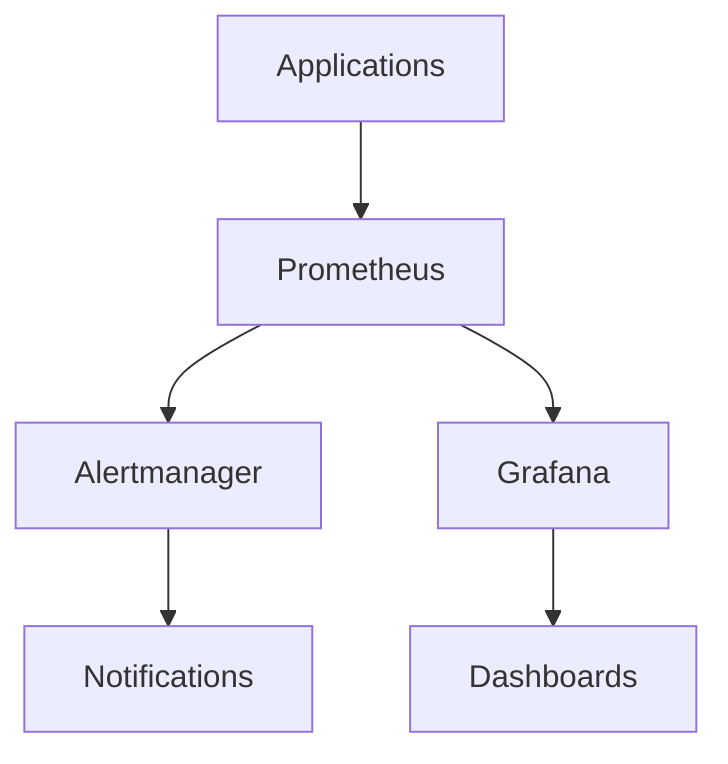

# ----------------------------------------------------------------------------
# File: 250208_MON_GUIDE_INT_v1.0_ANFL.md
# Location: /Volumes/mattstack/VSCode/AeonNovaFutureLabs/docs/monitoring/
#
# Purpose: Monitoring and observability documentation
# Security Level: Confidential
# Owner: Infrastructure Team
# Version: 1.0
# Last Modified: 2025-02-08
#
# References:
# - 250208_ARCH_OVERVIEW_INT_v1.0_ANFL.md
# - 250208_MONITOR_INT_v1.0_ANFL.zsh
# ----------------------------------------------------------------------------

# BLUF: Monitoring and observability guidelines for ANFL framework

## Monitoring Architecture

### 1. Core Components


### 2. Data Flow
- Metrics collection
- Data aggregation
- Alert processing
- Visualization
- Notification delivery

## Metrics Collection

### 1. System Metrics
```yaml
# System metrics configuration
metrics:
  system:
    - cpu_usage
    - memory_usage
    - disk_usage
    - network_io
    - process_stats
```

### 2. Application Metrics
```yaml
# Application metrics
metrics:
  application:
    - request_count
    - response_time
    - error_rate
    - active_users
    - throughput
```

### 3. AI Metrics
```yaml
# AI system metrics
metrics:
  ai:
    - model_latency
    - inference_accuracy
    - resource_usage
    - batch_size
    - queue_length
```

## Monitoring Setup

### 1. Prometheus
```yaml
# prometheus.yml
global:
  scrape_interval: 15s
  evaluation_interval: 15s

scrape_configs:
  - job_name: 'anfl'
    static_configs:
      - targets: ['localhost:9090']
```

### 2. Grafana
```yaml
# grafana.ini
[server]
http_port = 3000

[security]
admin_user = admin
admin_password = secure_password

[auth]
disable_login_form = false
```

### 3. Alertmanager
```yaml
# alertmanager.yml
route:
  group_by: ['alertname']
  group_wait: 30s
  group_interval: 5m
  repeat_interval: 1h
  receiver: 'team-notifications'
```

## Dashboard Configuration

### 1. System Overview
```json
{
  "dashboard": {
    "title": "System Overview",
    "panels": [
      {
        "title": "CPU Usage",
        "type": "graph",
        "metrics": ["system_cpu_usage"]
      },
      {
        "title": "Memory Usage",
        "type": "graph",
        "metrics": ["system_memory_usage"]
      }
    ]
  }
}
```

### 2. AI Performance
```json
{
  "dashboard": {
    "title": "AI Performance",
    "panels": [
      {
        "title": "Model Latency",
        "type": "graph",
        "metrics": ["model_inference_time"]
      },
      {
        "title": "Accuracy",
        "type": "gauge",
        "metrics": ["model_accuracy"]
      }
    ]
  }
}
```

## Alert Configuration

### 1. System Alerts
```yaml
groups:
  - name: system
    rules:
      - alert: HighCPUUsage
        expr: cpu_usage > 80
        for: 5m
        labels:
          severity: warning
        annotations:
          summary: High CPU usage detected
```

### 2. Application Alerts
```yaml
groups:
  - name: application
    rules:
      - alert: HighErrorRate
        expr: error_rate > 0.1
        for: 5m
        labels:
          severity: critical
        annotations:
          summary: High error rate detected
```

## Logging

### 1. Log Collection
```yaml
# logging configuration
logging:
  level: INFO
  format: json
  outputs:
    - type: file
      path: /var/log/anfl.log
    - type: elasticsearch
      host: localhost:9200
```

### 2. Log Processing
```python
def process_logs():
    # Parse logs
    logs = parse_log_entries()
    
    # Extract metrics
    metrics = extract_metrics(logs)
    
    # Store metrics
    store_metrics(metrics)
    
    # Generate alerts
    check_alerts(metrics)
```

## Visualization

### 1. Grafana Dashboards
- System Overview
- Application Performance
- AI Metrics
- Error Tracking
- Resource Usage

### 2. Custom Panels
```json
{
  "panel": {
    "type": "custom",
    "options": {
      "calculation": "custom_metric",
      "display": "gauge",
      "thresholds": [
        { "value": 80, "color": "red" }
      ]
    }
  }
}
```

## Best Practices

### 1. Metric Collection
- Regular intervals
- Consistent naming
- Proper tagging
- Data retention
- Performance impact

### 2. Alert Configuration
- Clear conditions
- Proper thresholds
- Meaningful messages
- Appropriate severity
- Notification routing

### 3. Dashboard Design
- Clear layout
- Important metrics
- Proper timeframes
- Useful visualizations
- Regular updates

## Troubleshooting

### 1. Common Issues
- Data collection
- Alert firing
- Dashboard loading
- Query performance
- Integration issues

### 2. Debug Process
```bash
# Check Prometheus status
curl localhost:9090/-/healthy

# Check Grafana logs
tail -f /var/log/grafana/grafana.log

# Verify metrics
curl localhost:9090/api/v1/query?query=up
```

## References

### Documentation
- Prometheus Docs
- Grafana Docs
- Alertmanager Docs
- Monitoring Guide

### Tools
- Monitoring Tools
- Visualization Tools
- Alert Tools
- Debug Tools

## Support

For monitoring issues:
1. Check documentation
2. Review logs
3. Contact infrastructure team

## License
Confidential and proprietary. All rights reserved.

---
© 2025 Aeon Nova Future Labs. All rights reserved.