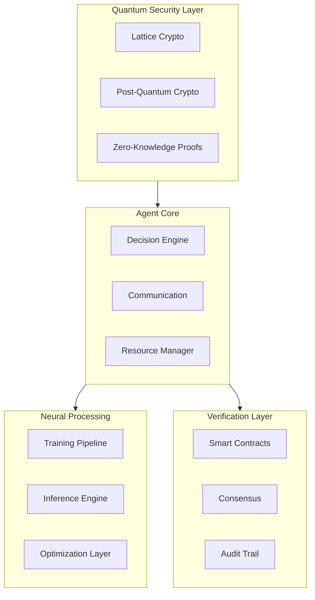

# 241213_AI_AGENT_INT_v2.0_ANFL
# Enhanced AI Agent Architecture
# Security Level: Confidential
# Owner: Infrastructure Team
# Last Modified: 2024-12-13

## BLUF (Bottom Line Up Front)
Comprehensive AI agent architecture implementing quantum-secure communication, lattice-based authentication, and blockchain verification within the Aeon Nova Framework. Ensures post-quantum security while maintaining high performance and scalability through neural network optimization.

## System Architecture

### Core Components Overview



## Implementation Details

### 1. Quantum-Secure Agent Framework

#### 1.1 Lattice-Based Authentication
```yaml
lattice_auth:
  algorithm: CRYSTALS-Kyber
  parameters:
    dimension: 3072
    modulus: "q=3329"
  key_exchange:
    protocol: LWE-Based
    refresh_interval: 24h

  zero_knowledge:
    proofs:
      type: lattice_based_zkp
      protocol: quantum_resistant
      verification: blockchain_backed
```

#### 1.2 Agent Communication
```python
class QuantumSecureAgent:
    """
    Quantum-secure agent implementation
    """
    def __init__(self):
        self.quantum_crypto = QuantumCrypto()
        self.lattice_auth = LatticeAuth()
        self.blockchain = BlockchainVerification()
        
    async def secure_communicate(
        self,
        message: Message,
        target_agent: AgentID
    ) -> CommunicationResult:
        """Execute quantum-secure communication"""
        try:
            # Quantum-resistant encryption
            encrypted_msg = await self.quantum_crypto.encrypt(
                message,
                scheme="kyber-1024"
            )
            
            # Lattice-based authentication
            auth_token = await self.lattice_auth.generate_token(
                self.agent_id,
                target_agent
            )
            
            # Blockchain verification
            verification = await self.blockchain.verify_communication(
                source=self.agent_id,
                target=target_agent,
                message_hash=encrypted_msg.hash
            )
            
            return await self.send_message(
                encrypted_msg,
                auth_token,
                verification
            )
            
        except Exception as e:
            await self.alert_system.raise_alert(
                level="ERROR",
                component="quantum_communication",
                error=e
            )
            raise
```

### 2. Neural Network Integration

#### 2.1 Training Optimization
```yaml
neural_optimization:
  training:
    quantum_resistant:
      - Secure gradient aggregation
      - Encrypted backpropagation
      - Protected model updates
    
    performance:
      batch_size: dynamic
      learning_rate: adaptive
      resource_allocation: optimized

  inference:
    security:
      - Model encryption
      - Secure inference
      - Result verification
    
    acceleration:
      - Batch processing
      - Cache optimization
      - Hardware acceleration
```

#### 2.2 Resource Management
```python
class NeuralResourceManager:
    """
    Manages neural network resources with quantum security
    """
    def __init__(self):
        self.resource_monitor = ResourceMonitor()
        self.quantum_verifier = QuantumVerifier()
        self.optimizer = NetworkOptimizer()
        
    async def optimize_resources(
        self,
        network: NeuralNetwork,
        constraints: ResourceConstraints
    ) -> OptimizationResult:
        """Optimize neural network resources"""
        try:
            # Analyze current usage
            usage = await self.resource_monitor.analyze()
            
            # Quantum-secure verification
            verification = await self.quantum_verifier.verify_resources(
                usage=usage,
                network=network
            )
            
            # Apply optimizations
            if verification.verified:
                optimization = await self.optimizer.optimize(
                    network=network,
                    usage=usage,
                    constraints=constraints
                )
                
                return OptimizationResult(
                    success=True,
                    optimizations=optimization,
                    verification=verification
                )
                
        except Exception as e:
            await self.alert_system.raise_alert(
                level="ERROR",
                component="neural_resources",
                error=e
            )
            raise
```

### 3. Blockchain Integration

#### 3.1 Smart Contract Framework
```solidity
// Agent Verification Contract
contract AgentVerification {
    struct AgentState {
        bytes32 stateHash;
        bytes32 modelHash;
        uint256 timestamp;
        address owner;
        string version;
    }

    mapping(bytes32 => AgentState) public agents;
    
    event AgentVerified(
        bytes32 indexed agentId,
        bytes32 stateHash,
        uint256 timestamp
    );

    function verifyAgent(
        bytes32 agentId,
        bytes32 stateHash,
        bytes32 modelHash
    ) public {
        require(
            msg.sender == getAuthorizedVerifier(),
            "Unauthorized verifier"
        );

        agents[agentId] = AgentState({
            stateHash: stateHash,
            modelHash: modelHash,
            timestamp: block.timestamp,
            owner: msg.sender,
            version: "1.0"
        });
        
        emit AgentVerified(
            agentId,
            stateHash,
            block.timestamp
        );
    }
}
```

#### 3.2 Consensus Mechanism
```yaml
consensus_config:
  mechanism: quantum_resistant_pos
  parameters:
    min_validators: 32
    epoch_length: 900
    block_time: 15
  
  verification:
    methods:
      - Lattice-based signatures
      - Zero-knowledge proofs
      - Quantum-resistant hashing
```

## Security Implementation

### 1. Quantum Security Controls
```yaml
security_controls:
  quantum_resistance:
    encryption:
      algorithm: CRYSTALS-Kyber
      key_rotation: 90d
    signatures:
      algorithm: CRYSTALS-Dilithium
      strength: 5
  
  neural_security:
    model_protection:
      - Encrypted weights
      - Secure gradients
      - Protected architecture
```

### 2. Access Control
```yaml
access_management:
  authentication:
    primary: quantum_resistant_tokens
    backup: lattice_based_signatures
    mfa: required
  
  authorization:
    model: rbac
    verification: blockchain_based
    audit: comprehensive
```

## Version History

| Version | Date | Author | Changes |
|---------|------|--------|---------|
| 2.0 | 2024-12-13 | Infrastructure Team | Enhanced quantum security integration |
| 1.0 | 2024-12-13 | Infrastructure Team | Initial agent architecture |

## Appendices

### A. Implementation References
- [Quantum Security Setup](docs/quantum_security.md)
- [Neural Network Integration](docs/neural_network.md)
- [Blockchain Configuration](docs/blockchain_setup.md)

### B. Security Protocols
- [Key Management](security/key_management.md)
- [Access Control](security/access_control.md)
- [Audit Requirements](security/audit_requirements.md)