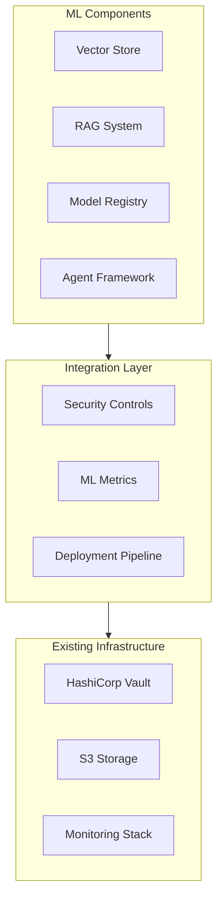

# 241213_ARCH_ML_INT_v1.0_ANFL
# ML Architecture Integration
# Security Level: Confidential
# Owner: Infrastructure Team
# Last Modified: 2024-12-13

## BLUF (Bottom Line Up Front)
Integration architecture for ML capabilities into existing Aeon Nova Framework, focusing on RAG implementation, vector storage, and model registry enhancements while maintaining compliance with established security and operational standards.

## ML Component Architecture

### Core Components Integration



### Implementation Requirements

1. Vector Store Implementation
- Storage Backend: Pinecone with 3072-dimension vectors
- Caching: Redis layer integration
- Security: Vault-managed credentials
- Monitoring: Custom vector operation metrics

2. RAG System Architecture
- Document Processing Pipeline
- Embedding Generation
- Vector Search Optimization
- Results Reranking

3. Model Registry Enhancement
- Model Version Control
- Metadata Management
- Automated Evaluation
- Deployment Automation

### Security Integration

1. Authentication & Authorization
```yaml
auth_integration:
  vault_mount_points:
    ml_services: auth/ml-services
    vector_store: auth/vector-store
  policies:
    - ml_admin_policy
    - vector_store_policy
    - model_registry_policy
```

2. Data Protection
```yaml
data_protection:
  vector_encryption:
    method: AES-256-GCM
    key_rotation: 90d
  model_storage:
    encryption: AWS-KMS
    access_control: RBAC
```

### Monitoring Integration

1. ML-Specific Metrics
```yaml
ml_metrics:
  vector_operations:
    - operation_latency
    - similarity_scores
    - cache_hit_ratio
  model_registry:
    - deployment_status
    - version_tracking
    - evaluation_metrics
```

2. Alert Configuration
```yaml
ml_alerts:
  vector_store:
    - name: high_latency
      threshold: 100ms
      window: 5m
  model_registry:
    - name: deployment_failure
      severity: critical
      notification: immediate
```

## Implementation Phases

### Phase 1: Foundation
1. Vector Store Setup
   - Infrastructure provisioning
   - Security integration
   - Basic monitoring

### Phase 2: RAG Implementation
1. Document Processing
   - Chunking strategy
   - Embedding pipeline
   - Retrieval optimization

### Phase 3: Model Registry
1. Storage Setup
   - Version control
   - Metadata management
   - Deployment automation

### Phase 4: Agent Framework
1. Tool Integration
   - API security
   - Workflow management
   - Monitoring setup

## Security Considerations

### Data Protection
1. Vector Encryption
   - At-rest encryption
   - In-transit security
   - Access controls

2. Model Security
   - Model versioning
   - Access logging
   - Deployment validation

## Version History

| Version | Date | Author | Changes |
|---------|------|--------|---------|
| 1.0 | 2024-12-13 | Infrastructure Team | Initial ML architecture documentation |

## Appendices

### A. Reference Architecture
- [Vector Store Design](docs/vector_store.md)
- [RAG Implementation](docs/rag_system.md)
- [Model Registry](docs/model_registry.md)

### B. Security Controls
- [ML Security Policies](security/ml_policies.md)
- [Access Controls](security/access_controls.md)
- [Monitoring Setup](security/monitoring.md)
