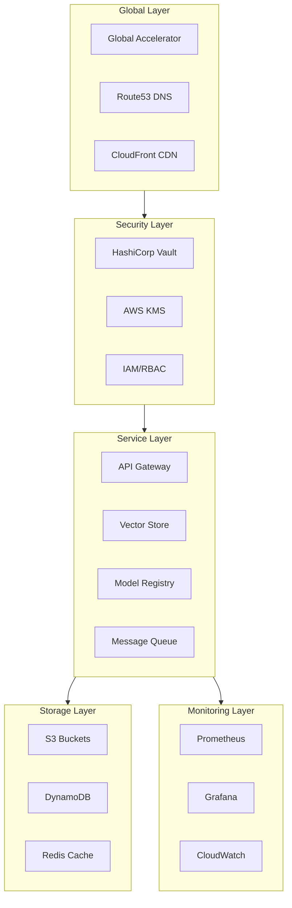
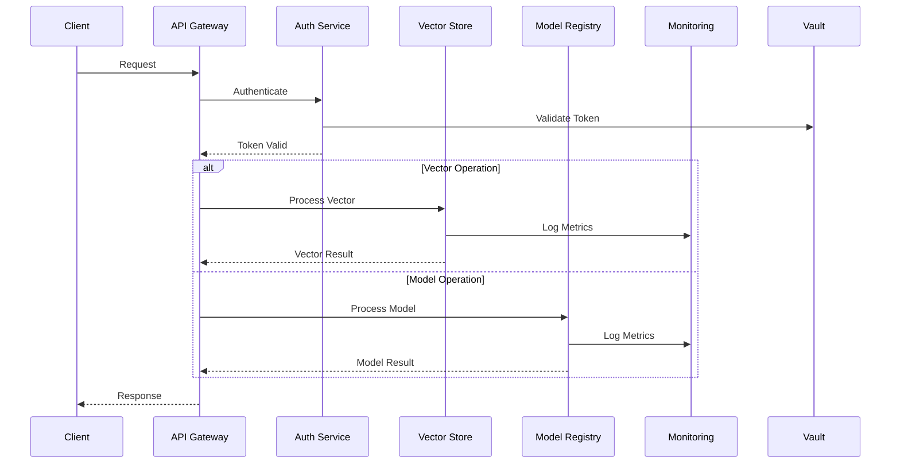
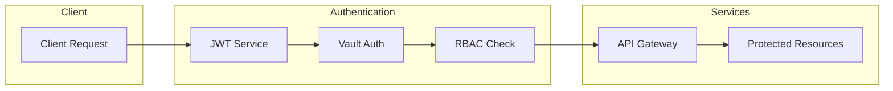
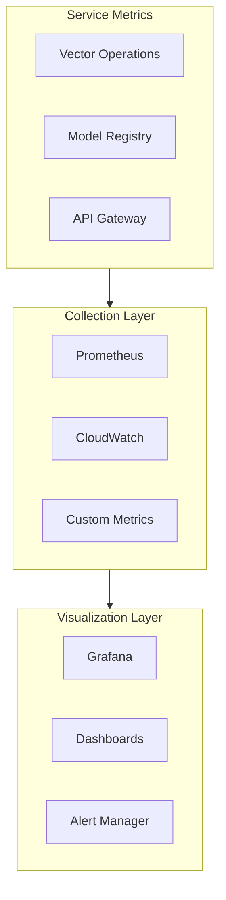

# 241213_ARCH_SYSTEM_INT_v1.0_ANFL
# Aeon Nova Framework Library Agent - System Architecture
# Security Level: Confidential
# Owner: Infrastructure Team
# Last Modified: 2024-12-13

## BLUF (Bottom Line Up Front)
The Aeon Nova Framework Library Agent implements a scalable, multi-region architecture integrating secure vector storage, model registry, and monitoring capabilities. The system follows a microservices architecture pattern with emphasis on security, observability, and high availability.

## System Overview

### Core Architecture



## Component Architecture

### Service Integration Flow



## Infrastructure Components

### Network Architecture
```yaml
network:
  global:
    regions:
      - us-west-1
      - us-east-1
      - eu-west-1
    route53:
      zones:
        - aeonova.com
        - lib.aeonova.com
  vpc:
    cidr: 10.0.0.0/16
    subnets:
      public:
        - 10.0.1.0/24
        - 10.0.2.0/24
      private:
        - 10.0.10.0/24
        - 10.0.11.0/24
```

### Compute Resources
```yaml
compute:
  ecs:
    clusters:
      - name: vector-processing
        instance_type: c5.2xlarge
        min_size: 3
        max_size: 10
      - name: model-registry
        instance_type: m5.2xlarge
        min_size: 2
        max_size: 8
  lambda:
    functions:
      - name: vector-processing
        memory: 1024
        timeout: 300
      - name: model-validation
        memory: 2048
        timeout: 600
```

## Security Architecture

### Authentication Flow



### Data Protection
```yaml
encryption:
  at_rest:
    method: AWS KMS
    key_rotation: 90 days
  in_transit:
    method: TLS 1.3
    certificate: ACM
  application:
    method: Vault Transit
    key_type: AES-256-GCM
```

## Monitoring Architecture

### Metrics Collection



### Alert Configuration
```yaml
alerts:
  critical:
    - name: service_down
      threshold: 1
      duration: 5m
    - name: high_error_rate
      threshold: 5%
      duration: 15m
  warning:
    - name: high_latency
      threshold: 1s
      duration: 10m
    - name: resource_usage
      threshold: 80%
      duration: 30m
```

## Scaling Architecture

### Auto Scaling Configuration
```yaml
scaling:
  vector_processing:
    metrics:
      - cpu_utilization
      - queue_depth
    thresholds:
      scale_up: 75%
      scale_down: 25%
    cooldown:
      scale_up: 300
      scale_down: 600
```

## Disaster Recovery

### Backup Strategy
```yaml
backup:
  databases:
    frequency: daily
    retention: 30d
    type: snapshot
  vectors:
    frequency: hourly
    retention: 7d
    type: incremental
  configuration:
    frequency: daily
    retention: 90d
    type: full
```

### Recovery Procedures
```yaml
recovery:
  rto: 4h
  rpo: 1h
  steps:
    - validate_backup
    - restore_infrastructure
    - verify_data
    - update_dns
```

## Version History

| Version | Date     | Author | Changes                               |
|---------|----------|--------|---------------------------------------|
| 1.0     | 2024-12-13| Infrastructure Team | Initial architecture documentation |

## Appendices

### A. Reference Architecture
- [AWS Architecture](../docs/aws_architecture.md)
- [Security Architecture](../docs/security_architecture.md)
- [Monitoring Architecture](../docs/monitoring_architecture.md)

### B. Configuration Templates
- [Terraform Templates](../terraform/templates/)
- [Vault Policies](../vault/policies/)
- [Monitoring Rules](../monitoring/rules/)