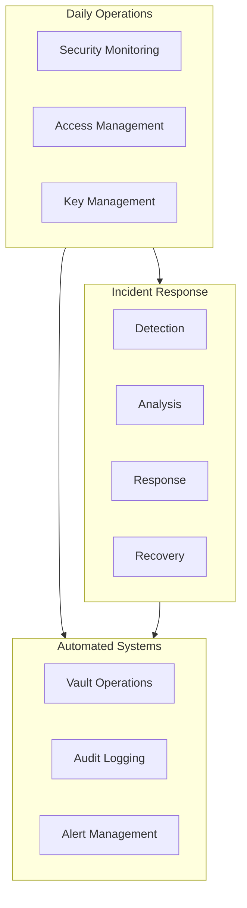

# 241213_SEC_OPS_INT_v1.0_ANFL
# Security Operations Framework
# Security Level: Confidential
# Owner: Infrastructure Team
# Last Modified: 2024-12-13

## BLUF (Bottom Line Up Front)
Comprehensive security operations framework implementing day-to-day security procedures, incident response protocols, and monitoring systems for the Aeon Nova Framework. Integrates quantum-secure measures, blockchain verification, and automated compliance monitoring while maintaining operational efficiency.

## System Architecture

### Security Operations Overview



## 1. Daily Security Operations

### 1.1 Access Management
```yaml
access_management:
  vault_operations:
    auth_methods:
      approle:
        mount_point: auth/approle
        config_paths:
          role_id: /etc/vault-agent-config/role_id
          secret_id: /etc/vault-agent-config/secret_id
      jwt:
        mount_point: auth/jwt
        config: auth_jwt.yml
      kubernetes:
        mount_point: auth/kubernetes
        config: auth_kubernetes.yml

  policy_enforcement:
    validation:
      frequency: real-time
      method: blockchain_verification
      audit: comprehensive
    monitoring:
      - Access attempts
      - Policy violations
      - Permission changes

  quantum_security:
    authentication:
      primary: quantum_resistant_tokens
      backup: lattice_based_signatures
      rotation: 90d
```

### 1.2 Key Management Operations
```yaml
key_operations:
  rotation_procedures:
    schedule:
      encryption_keys: 90d
      authentication_keys: 60d
      signing_keys: 30d
    
    automation:
      triggers:
        - Schedule-based
        - Security incident
        - Compliance requirement
      validation:
        - Key integrity
        - Access verification
        - Usage confirmation

  backup_procedures:
    storage:
      primary: hardware_security_module
      backup: encrypted_distributed
      recovery: multi_party_authorization
    
    verification:
      schedule: weekly
      process:
        - Integrity check
        - Recovery test
        - Access validation
```

## 2. Security Monitoring

### 2.1 Monitoring Configuration
```yaml
monitoring_framework:
  metrics_collection:
    security_events:
      - Authentication attempts
      - Policy violations
      - Encryption operations
    system_health:
      - Resource utilization
      - Service status
      - Performance metrics
    compliance_status:
      - Control effectiveness
      - Policy adherence
      - Audit readiness

  prometheus_config:
    retention: 15d
    scrape_interval: 15s
    metrics:
      - name: security_events_total
        type: counter
        labels: [event_type, severity]
      - name: auth_attempts_total
        type: counter
        labels: [status, method]
      - name: encryption_operations_total
        type: counter
        labels: [operation, status]
```

### 2.2 Alert Configuration
```yaml
alert_system:
  rules:
    critical:
      - name: security_breach
        condition: security_events{severity="critical"} > 0
        duration: 1m
        channels: [security_team, management]
      
      - name: auth_failure_spike
        condition: rate(auth_attempts_total{status="failure"}[5m]) > 10
        duration: 5m
        channels: [security_team]

    warning:
      - name: unusual_activity
        condition: rate(security_events_total[15m]) > historical_avg * 2
        duration: 15m
        channels: [security_team]

  notification_channels:
    slack:
      channel: "#alerts"
      severity_threshold: warning
    email:
      team: platform-ops
      frequency: immediate
```

## 3. Incident Response

### 3.1 Detection and Analysis
```yaml
incident_management:
  detection:
    automated_systems:
      - Security event correlation
      - Behavioral analysis
      - Pattern recognition
    manual_reporting:
      - User reports
      - System alerts
      - Audit findings

  analysis:
    initial_assessment:
      - Severity classification
      - Impact evaluation
      - Scope determination
    detailed_investigation:
      - Root cause analysis
      - Evidence collection
      - Timeline reconstruction
```

### 3.2 Response Procedures
```yaml
response_procedures:
  immediate_actions:
    critical:
      - System isolation
      - Evidence preservation
      - Stakeholder notification
    high:
      - Threat containment
      - Access restriction
      - Impact mitigation

  recovery_process:
    steps:
      - System restoration
      - Data verification
      - Service validation
    documentation:
      - Incident report
      - Action timeline
      - Lesson learned
```

## 4. Automation and Integration

### 4.1 Automated Security Tasks
```python
class SecurityAutomation:
    """
    Manages automated security operations
    """
    def __init__(self):
        self.vault_manager = VaultManager()
        self.audit_system = AuditSystem()
        self.monitor = SecurityMonitor()
        
    async def run_security_checks(self) -> SecurityReport:
        """Execute automated security checks"""
        try:
            # Check security controls
            control_status = await self.check_security_controls()
            
            # Verify compliance status
            compliance = await self.verify_compliance()
            
            # Monitor system health
            health = await self.monitor.check_health()
            
            return SecurityReport(
                controls=control_status,
                compliance=compliance,
                health=health,
                timestamp=datetime.now()
            )
            
        except Exception as e:
            await self.alert_system.raise_alert(
                level="ERROR",
                component="security_automation",
                error=e
            )
            raise
```

### 4.2 Integration Points
```yaml
integration_config:
  vault_integration:
    auth_methods:
      - path: auth/approle
        type: approle
        config: auth_approle.yml
      - path: auth/jwt
        type: jwt
        config: auth_jwt.yml

  monitoring_integration:
    prometheus:
      job_name: security_monitoring
      metrics_path: /metrics
      scrape_interval: 15s
    grafana:
      dashboards:
        - security_overview
        - compliance_status
        - incident_tracking
```

## Version History

| Version | Date | Author | Changes |
|---------|------|--------|---------|
| 1.0 | 2024-12-13 | Infrastructure Team | Initial security operations framework |

## Appendices

### A. Operational Procedures
- [Access Management](procedures/access_management.md)
- [Key Rotation](procedures/key_rotation.md)
- [Incident Response](procedures/incident_response.md)

### B. Integration References
- [Vault Configuration](config/vault_config.md)
- [Monitoring Setup](config/monitoring_setup.md)
- [Alert Rules](config/alert_rules.md)