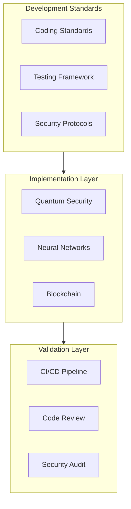

# 241213_DEV_STANDARDS_INT_v1.0_ANFL
# Development Standards Framework
# Security Level: Confidential
# Owner: Infrastructure Team
# Last Modified: 2024-12-13

## BLUF (Bottom Line Up Front)
Comprehensive development standards framework establishing coding practices, testing requirements, and security protocols for the Aeon Nova Framework. Incorporates quantum-secure development practices, neural network optimization guidelines, and blockchain integration standards while maintaining strict compliance with ISO27001 and GDPR requirements.

## System Architecture

### Development Framework Overview



## 1. Coding Standards

### 1.1 Core Development Principles
```yaml
coding_standards:
  style_guide:
    python:
      formatting:
        line_length: 88
        indentation: 4
        quotes: double
      tools:
        - black
        - isort
        - flake8
        - mypy

  documentation:
    requirements:
      - Google-style docstrings
      - Type hints
      - Architecture diagrams
      - Security considerations
    validation:
      - Documentation coverage check
      - Link validation
      - Security review

  version_control:
    branching:
      pattern: "${type}/${ticket_id}-${description}"
      types:
        - feature
        - bugfix
        - hotfix
        - release
    commit_messages:
      format: "${type}(${scope}): ${description}"
      types:
        - feat
        - fix
        - docs
        - style
        - refactor
```

### 1.2 Security Implementation
```python
class QuantumSecureImplementation:
    """
    Quantum-secure development practices
    """
    def __init__(self):
        self.crypto_validator = CryptoValidator()
        self.security_checker = SecurityChecker()
        
    async def validate_implementation(
        self,
        code: CodeBase,
        security_level: SecurityLevel
    ) -> ValidationResult:
        """Validate quantum security implementation"""
        try:
            # Verify quantum resistance
            crypto_check = await self.crypto_validator.check_algorithms(
                code.crypto_implementations,
                required_strength='quantum_resistant'
            )
            
            # Security analysis
            security_scan = await self.security_checker.analyze(
                code=code,
                requirements=security_level
            )
            
            return ValidationResult(
                crypto_status=crypto_check,
                security_status=security_scan,
                recommendations=self.generate_recommendations(
                    crypto_check,
                    security_scan
                )
            )
            
        except Exception as e:
            await self.alert_system.raise_alert(
                level="ERROR",
                component="security_validation",
                error=e
            )
            raise
```

## 2. Testing Requirements

### 2.1 Testing Framework
```yaml
testing_framework:
  unit_tests:
    coverage:
      minimum: 80%
      critical_paths: 95%
    tools:
      - pytest
      - pytest-cov
      - pytest-asyncio
    requirements:
      - Test isolation
      - Deterministic results
      - Mock external services

  integration_tests:
    coverage:
      minimum: 70%
      api_endpoints: 100%
    components:
      - API contracts
      - Database operations
      - External services

  security_testing:
    requirements:
      - Quantum resistance validation
      - Blockchain verification
      - Neural network security
    tools:
      - bandit
      - safety
      - owasp-zap
```

### 2.2 Neural Network Testing
```python
class NeuralNetworkValidator:
    """
    Neural network validation framework
    """
    def __init__(self):
        self.model_validator = ModelValidator()
        self.performance_tester = PerformanceTester()
        self.security_checker = SecurityChecker()
        
    async def validate_neural_network(
        self,
        model: NeuralNetwork,
        requirements: ValidationRequirements
    ) -> ValidationResult:
        """Comprehensive neural network validation"""
        try:
            # Model architecture validation
            architecture_check = await self.model_validator.validate_architecture(
                model=model,
                requirements=requirements.architecture
            )
            
            # Performance testing
            performance_results = await self.performance_tester.test_model(
                model=model,
                test_data=requirements.test_data,
                metrics=requirements.metrics
            )
            
            # Security validation
            security_status = await self.security_checker.validate_model_security(
                model=model,
                security_requirements=requirements.security
            )
            
            return ValidationResult(
                architecture=architecture_check,
                performance=performance_results,
                security=security_status,
                passed=all([
                    architecture_check.passed,
                    performance_results.meets_requirements,
                    security_status.passed
                ])
            )
            
        except Exception as e:
            await self.alert_system.raise_alert(
                level="ERROR",
                component="neural_validation",
                error=e
            )
            raise
```

## 3. CI/CD Pipeline

### 3.1 Pipeline Configuration
```yaml
pipeline_config:
  stages:
    validate:
      - Lint code
      - Check formatting
      - Verify dependencies
    
    test:
      - Unit tests
      - Integration tests
      - Security scans
    
    build:
      - Compile assets
      - Build containers
      - Generate documentation
    
    deploy:
      - Deploy to staging
      - Run smoke tests
      - Promote to production

  security_gates:
    requirements:
      - Quantum security validation
      - Dependency scanning
      - Container scanning
    thresholds:
      critical: 0
      high: 0
      medium: review
```

### 3.2 Deployment Procedures
```yaml
deployment_procedures:
  environments:
    development:
      auto_deploy: true
      validation: minimal
      monitoring: basic
    
    staging:
      auto_deploy: false
      validation: standard
      monitoring: enhanced
    
    production:
      auto_deploy: false
      validation: strict
      monitoring: comprehensive
      approvers: [security_team, tech_lead]
```

## 4. Documentation Requirements

### 4.1 Code Documentation
```yaml
documentation_standards:
  requirements:
    code:
      - Class and method documentation
      - Type hints
      - Usage examples
      - Security considerations
    
    architecture:
      - System diagrams
      - Component interactions
      - Security protocols
      - Deployment procedures

  validation:
    automated:
      - Documentation coverage
      - Link checking
      - Style conformance
    manual:
      - Technical review
      - Security review
      - Usability assessment
```

### 4.2 API Documentation
```yaml
api_documentation:
  specification:
    format: OpenAPI 3.0
    requirements:
      - Endpoint descriptions
      - Request/response schemas
      - Security requirements
      - Rate limits
    
  security:
    authentication:
      - OAuth 2.0 flows
      - Token management
      - Quantum resistance
    authorization:
      - RBAC definitions
      - Permission schemas
      - Access controls
```

## Version History

| Version | Date | Author | Changes |
|---------|------|--------|---------|
| 1.0 | 2024-12-13 | Infrastructure Team | Initial development standards |

## Appendices

### A. Reference Documentation
- [Coding Style Guide](docs/style_guide.md)
- [Testing Framework](docs/testing.md)
- [Security Standards](docs/security.md)

### B. Templates and Examples
- [Code Templates](templates/code/)
- [Documentation Templates](templates/docs/)
- [Test Templates](templates/tests/)