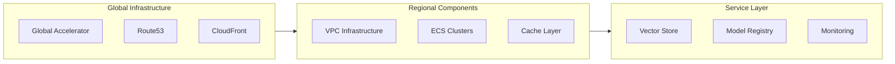

# 241213_OPS_PROC_INT_v1.0_ANFL
# Aeon Nova Framework Library Agent - Operations Procedures
# Security Level: Confidential
# Owner: Infrastructure Team
# Last Modified: 2024-12-13

## BLUF (Bottom Line Up Front)
Comprehensive operational procedures for managing, monitoring, and maintaining the Aeon Nova Framework Library Agent infrastructure, including emergency response procedures and routine maintenance tasks.

## Infrastructure Management

### Component Status Overview



### Maintenance Procedures
```yaml
maintenance:
  scheduled:
    backup:
      frequency: daily
      retention: 30d
      type: full
    
    health_check:
      frequency: hourly
      components:
        - vector_store
        - model_registry
        - monitoring_stack
    
    system_updates:
      frequency: weekly
      window: "Sunday 02:00 UTC"
      duration: 2h
```

## Emergency Response

### Incident Classification
```yaml
incidents:
  critical:
    response_time: 15m
    notification: immediate
    channels:
      - pagerduty
      - slack-urgent
  
  high:
    response_time: 30m
    notification: immediate
    channels:
      - slack-alerts
  
  medium:
    response_time: 2h
    notification: next_business_hour
    channels:
      - email
```

### Recovery Procedures
```yaml
recovery:
  vector_store:
    steps:
      - validate_data_integrity
      - restore_from_backup
      - verify_indices
      - resume_operations
  
  model_registry:
    steps:
      - snapshot_current_state
      - apply_recovery_plan
      - validate_models
      - resume_service
```

## Routine Operations

### Daily Tasks
```yaml
daily_tasks:
  monitoring:
    - review_alerts
    - check_metrics
    - validate_backups
  
  maintenance:
    - clear_stale_cache
    - rotate_logs
    - update_metrics
```

### Weekly Tasks
```yaml
weekly_tasks:
  security:
    - audit_access_logs
    - review_permissions
    - check_certificates
  
  performance:
    - analyze_metrics
    - optimize_resources
    - review_scaling_policies
```

## Monitoring and Alerts

### Alert Response Matrix
| Severity | Response Time | Action Required | Escalation |
|----------|---------------|-----------------|------------|
| Critical | 15 minutes | Immediate intervention | CTO |
| High | 30 minutes | Team response | Lead Engineer |
| Medium | 2 hours | Scheduled response | Team Manager |
| Low | 24 hours | Next business day | Team Member |

### Health Checks
```yaml
health_checks:
  endpoints:
    vector_store:
      - /health
      - /metrics
      - /status
    
    model_registry:
      - /health
      - /readiness
      - /liveness
```

## Backup and Recovery

### Backup Schedule
```yaml
backups:
  databases:
    frequency: hourly
    retention: 7d
    type: incremental
  
  vectors:
    frequency: daily
    retention: 30d
    type: full
  
  configurations:
    frequency: daily
    retention: 90d
    type: full
```

### Recovery Testing
```yaml
recovery_testing:
  schedule: monthly
  components:
    - vector_store
    - model_registry
    - monitoring
  validation:
    - data_integrity
    - performance_metrics
    - security_compliance
```

## Security Operations

### Access Management
```yaml
access_management:
  review_frequency: weekly
  rotation_policy:
    keys: 90d
    credentials: 60d
    certificates: 365d
  
  audit_requirements:
    - access_logs
    - permission_changes
    - authentication_attempts
```

### Security Monitoring
```yaml
security_monitoring:
  realtime_alerts:
    - unauthorized_access
    - unusual_patterns
    - system_breaches
  
  scheduled_scans:
    vulnerability:
      frequency: daily
      tool: security_scanner
    
    compliance:
      frequency: weekly
      standards:
        - ISO27001
        - GDPR
```

## Version History

| Version | Date | Author | Changes |
|---------|------|--------|---------|
| 1.0 | 2024-12-13 | Infrastructure Team | Initial operations procedures |

## Appendices

### A. Command Reference
```bash
# Health check commands
curl -X GET https://api.aeonova.com/health
curl -X GET https://api.aeonova.com/metrics

# Backup commands
./scripts/backup.sh full
./scripts/backup.sh incremental

# Recovery commands
./scripts/recover.sh vector-store
./scripts/recover.sh model-registry
```

### B. Contact Information
```yaml
contacts:
  infrastructure:
    primary: ops-team@aeonova.com
    urgent: +1-555-0123
  
  security:
    primary: security@aeonova.com
    urgent: +1-555-0124
```