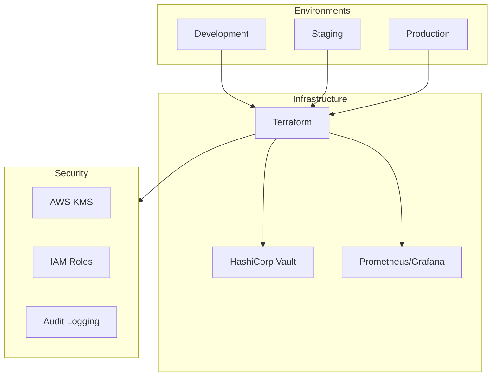

# 241213_PROC_DEPLOY_INT_v1.0_ANFL
# Aeon Nova Framework Library Agent - Deployment Procedures
# Security Level: Confidential
# Owner: Infrastructure Team
# Last Modified: 2024-12-13

## BLUF (Bottom Line Up Front)
This document outlines the standardized deployment procedures for the Aeon Nova Framework Library Agent, ensuring consistent, secure, and monitored deployments across development, staging, and production environments. The procedures integrate with Vault for secret management, Prometheus for monitoring, and follow strict security protocols.

## Deployment Architecture

### Environment Structure



## Deployment Workflow

### 1. Pre-Deployment Checklist
```yaml
verification:
  infrastructure:
    - terraform_plan_verified
    - vault_policies_current
    - monitoring_configured
  security:
    - secrets_rotated
    - certificates_valid
    - permissions_verified
  compliance:
    - gdpr_requirements_met
    - audit_logging_enabled
    - backup_completed
```

### 2. Environment-Specific Configurations

#### Development Environment
```yaml
environment:
  name: dev
  workspace: dev
  approvers: Team Lead
  configurations:
    vault:
      auth_method: approle
      policy_path: policies/dev
    monitoring:
      retention: 7d
      alerts: minimal
    scaling:
      min_capacity: 1
      max_capacity: 2
```

#### Staging Environment
```yaml
environment:
  name: staging
  workspace: staging
  approvers: DevOps Lead
  configurations:
    vault:
      auth_method: jwt
      policy_path: policies/staging
    monitoring:
      retention: 15d
      alerts: standard
    scaling:
      min_capacity: 2
      max_capacity: 4
```

#### Production Environment
```yaml
environment:
  name: prod
  workspace: prod
  approvers: CTO
  configurations:
    vault:
      auth_method: kubernetes
      policy_path: policies/prod
    monitoring:
      retention: 30d
      alerts: comprehensive
    scaling:
      min_capacity: 3
      max_capacity: 10
```

## Deployment Steps

### 1. Infrastructure Provisioning
```bash
# Initialize Terraform workspace
terraform workspace select ${ENV}

# Generate and review plan
terraform plan -out=tfplan

# Apply infrastructure changes
terraform apply tfplan

# Verify deployment
terraform output -json > ${ENV}_deployment.json
```

### 2. Security Configuration
```hcl
# Vault policy configuration
path "secret/${ENV}/*" {
  capabilities = ["create", "read", "update", "delete"]
}

path "auth/token/create/${ENV}" {
  capabilities = ["create", "update"]
}
```

### 3. Monitoring Setup
```yaml
prometheus:
  scrape_configs:
    - job_name: '${ENV}-library-agent'
      scrape_interval: 15s
      static_configs:
        - targets: ['localhost:9090']

grafana:
  dashboards:
    - name: "${ENV} Overview"
      folder: "Library Agent"
      refresh: 1m
```

## Deployment Validation

### Health Checks
```yaml
validation:
  endpoints:
    - path: /health
      expected_status: 200
    - path: /metrics
      expected_status: 200
  metrics:
    - system_health
    - api_latency
    - error_rate
  thresholds:
    latency_ms: 500
    error_rate: 0.01
    cpu_usage: 80
```

### Security Verification
```yaml
security_checks:
  - vault_status
  - kms_key_rotation
  - certificate_validity
  - iam_role_permissions
  - security_group_rules
```

## Rollback Procedures

### Automated Rollback
```yaml
rollback:
  triggers:
    - health_check_failure
    - high_error_rate
    - security_breach
  procedure:
    - stop_deployment
    - revert_terraform
    - restore_backup
    - notify_team
```

### Manual Intervention
```yaml
manual_steps:
  - suspend_auto_scaling
  - verify_data_integrity
  - check_logs
  - restore_configuration
```

## Monitoring and Alerts

### Deployment Metrics
```yaml
metrics:
  collection:
    interval: 15s
    retention: 15d
  alerts:
    deployment_failure:
      threshold: 1
      window: 5m
    high_error_rate:
      threshold: 0.05
      window: 5m
```

### Alert Routing
```yaml
alert_routing:
  critical:
    channels:
      - "#alerts-${ENV}"
      - "ops-team@aeonova.com"
    escalation:
      timeout: 15m
      next_level: manager
  warning:
    channels:
      - "#alerts-${ENV}"
    escalation:
      timeout: 1h
      next_level: team-lead
```

## Documentation References

### Infrastructure
- [Terraform Modules](../terraform/modules/)
- [Vault Configuration](../vault/config/)
- [Monitoring Setup](../monitoring/setup/)

### Security
- [Security Controls](../security/controls/)
- [Access Policies](../security/policies/)
- [Audit Requirements](../security/audit/)

## Version History

| Version | Date     | Author | Changes                               |
|---------|----------|--------|---------------------------------------|
| 1.0     | 2024-12-13| Infrastructure Team | Initial deployment procedures |

## Appendices

### A. Command Reference
```bash
# Environment Setup
source ./scripts/env_setup.sh ${ENV}

# Infrastructure Deployment
./scripts/deploy.sh ${ENV}

# Monitoring Verification
./scripts/verify_monitoring.sh ${ENV}

# Security Validation
./scripts/security_check.sh ${ENV}
```

### B. Troubleshooting Guide
1. Deployment Failures
2. Security Alerts
3. Performance Issues
4. Rollback Scenarios