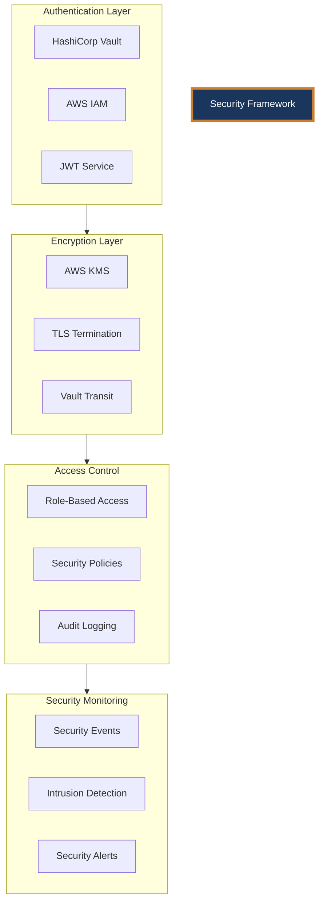

# 241213_SEC_FRAMEWORK_INT_v1.0_ANFL
# Aeon Nova Framework Security Implementation
# Security Level: Confidential
# Owner: Security Team
# Last Modified: 2024-12-13

## BLUF (Bottom Line Up Front)
This document outlines the comprehensive security framework implemented for the Aeon Nova Framework Library Agent, ensuring compliance with ISO27001 standards and GDPR requirements while maintaining operational efficiency and system integrity.

## Security Architecture

### Core Security Components



## Implementation Standards

### Authentication Flow
1. **Primary Authentication**
   ```yaml
   auth_methods:
     vault_approle:
       mount_point: auth/approle
       role_id_path: /etc/vault/role_id
       secret_id_path: /etc/vault/secret_id
     jwt:
       mount_point: auth/jwt
       default_role: service
     kubernetes:
       mount_point: auth/kubernetes
       role: library-agent
   ```

2. **Authorization Matrix**
   ```yaml
   roles:
     admin:
       capabilities: [create, read, update, delete]
       paths: 
         - secret/*
         - auth/*
     operator:
       capabilities: [read]
       paths:
         - secret/data/*
         - monitoring/*
     developer:
       capabilities: [read, create]
       paths:
         - secret/dev/*
         - models/dev/*
   ```

### Encryption Standards

1. **Data at Rest**
   - KMS encryption for all stored data
   - Regular key rotation (90 days)
   - Secure key backup procedures

2. **Data in Transit**
   - TLS 1.3 enforcement
   - Certificate management via ACM
   - Regular certificate rotation

3. **Application-Level Encryption**
   ```yaml
   encryption_config:
     algorithm: AES-256-GCM
     key_rotation: 90d
     backup_retention: 180d
     kms_key_alias: alias/library-agent-key
   ```

## Security Controls

### Access Control Implementation
```yaml
access_controls:
  rbac:
    roles:
      - admin
      - developer
      - operator
    permissions:
      admin:
        - full_access
        - audit_log_access
      developer:
        - read_access
        - write_models
      operator:
        - read_access
        - monitoring_access
```

### Audit Logging
```yaml
audit_config:
  log_levels:
    - SECURITY
    - ERROR
    - WARNING
  retention: 365d
  storage:
    type: S3
    bucket: audit-logs
    encryption: true
  monitoring:
    alerts:
      - unauthorized_access
      - encryption_failure
      - policy_violation
```

## Compliance Framework

### ISO27001 Controls
1. **Information Security Policies**
   - Document control procedures
   - Security policy review cycle
   - Incident response procedures

2. **Access Control**
   - Identity management
   - Privilege management
   - Access review procedures

3. **Cryptography**
   - Key management procedures
   - Encryption standards
   - Certificate management

### GDPR Compliance
1. **Data Protection**
   ```yaml
   data_protection:
     personal_data:
       encryption: required
       access_logging: enabled
       retention: specified
     data_processing:
       purpose: defined
       consent: tracked
       deletion: automated
   ```

2. **Privacy Controls**
   - Data minimization
   - Purpose limitation
   - Storage limitation

## Security Monitoring

### Metrics Collection
```yaml
security_metrics:
  collection:
    interval: 5m
    retention: 90d
  alerts:
    critical:
      - unauthorized_access_attempt
      - encryption_failure
      - certificate_expiry
    warning:
      - high_error_rate
      - unusual_access_pattern
      - resource_exhaustion
```

### Alert Configuration
```yaml
alert_rules:
  - name: unauthorized_access
    severity: critical
    condition: count > 5
    window: 5m
    channels:
      - security_team
      - ops_team
  
  - name: encryption_failure
    severity: critical
    condition: any
    window: 1m
    channels:
      - security_team
```

## Incident Response

### Response Procedures
1. **Detection**
   - Automated monitoring
   - Alert correlation
   - Threat intelligence

2. **Response**
   - Incident classification
   - Response team activation
   - Communication procedures

3. **Recovery**
   - System restoration
   - Post-incident analysis
   - Policy updates

### Communication Matrix
| Severity | First Response | Escalation | Notification |
|----------|---------------|------------|--------------|
| Critical | 15 minutes    | Immediate  | All teams    |
| High     | 30 minutes    | 1 hour     | Security team|
| Medium   | 2 hours       | 4 hours    | Team lead    |
| Low      | 8 hours       | 24 hours   | Daily report |

## Version History

| Version | Date     | Author | Changes                               |
|---------|----------|--------|---------------------------------------|
| 1.0     | 2024-12-13| Security Team | Initial security documentation |

## Appendices

### A. Security Procedures
1. Key Rotation
2. Access Review
3. Incident Response

### B. Reference Documentation
- [Vault Security Guide](docs/vault_security.md)
- [AWS Security Controls](docs/aws_security.md)
- [Compliance Framework](docs/compliance.md)