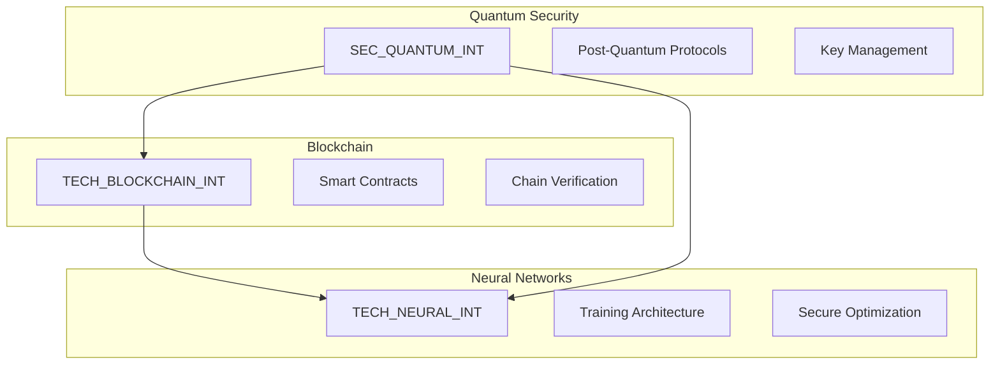

# Priority Documents Explanation

## 1. 241213_SEC_QUANTUM_INT_v1.0_ANFL (Quantum Security Architecture)

### Purpose
This document is critical as it establishes the foundational security architecture for quantum-resistant systems. It's a priority because all other components depend on these security implementations.

### Key Components
```yaml
quantum_security:
  core_elements:
    lattice_cryptography:
      - Implementation of CRYSTALS-Kyber for key encapsulation
      - CRYSTALS-Dilithium for digital signatures
      - Efficient parameter selection for security vs. performance
    
    key_management:
      - Quantum-resistant key generation
      - Key rotation policies
      - Emergency key replacement procedures
    
    transition_strategy:
      - Hybrid classical/quantum approach
      - Migration timelines
      - Legacy system integration
```

### Critical Aspects
1. Post-quantum cryptographic protocols
2. Key management infrastructure
3. Security monitoring and validation
4. Transition strategy from classical to quantum-resistant systems

## 2. 241213_TECH_BLOCKCHAIN_INT_v1.0_ANFL (Blockchain Integration)

### Purpose
Defines the blockchain architecture for secure verification and immutable audit trails. Critical for establishing trust and verification in the quantum-secure environment.

### Key Components
```yaml
blockchain_framework:
  architecture:
    smart_contracts:
      - Verification contracts for quantum states
      - Access control management
      - Audit trail implementation
    
    consensus:
      - Quantum-resistant consensus mechanisms
      - Cross-chain verification protocols
      - Performance optimization strategies
    
    integration:
      - API endpoints for blockchain interaction
      - Event monitoring and logging
      - Smart contract automation
```

### Critical Aspects
1. Smart contract architecture and deployment
2. Consensus mechanisms and validation
3. Cross-chain interoperability
4. Performance and scaling considerations

## 3. 241213_TECH_NEURAL_INT_v1.0_ANFL (Neural Network Framework)

### Purpose
Establishes the neural network architecture with built-in quantum security and blockchain verification. Essential for AI operations in a quantum-secure environment.

### Key Components
```yaml
neural_framework:
  architecture:
    training:
      - Secure gradient computation
      - Quantum-resistant parameter updates
      - Blockchain-verified training logs
    
    optimization:
      - Resource allocation strategies
      - Performance monitoring
      - Dynamic scaling algorithms
    
    security:
      - Model encryption protocols
      - Access control mechanisms
      - Audit trail implementation
```

### Critical Aspects
1. Neural network architecture with quantum security
2. Training and optimization protocols
3. Model security and verification
4. Performance monitoring and scaling

## Integration Strategy

### Cross-Document Dependencies


### Implementation Timeline

1. Week 1-2: Quantum Security Architecture
   - Core cryptographic implementations
   - Key management infrastructure
   - Security monitoring setup

2. Week 3-4: Blockchain Integration
   - Smart contract development
   - Consensus mechanism implementation
   - Cross-chain verification setup

3. Week 5-6: Neural Network Framework
   - Secure training pipeline
   - Optimization framework
   - Integration with quantum security and blockchain

### Critical Success Factors

1. Security Integration
```yaml
success_metrics:
  security:
    quantum_resistance:
      - Algorithm implementation
      - Key management
      - Performance benchmarks
    
    blockchain:
      - Contract deployment
      - Verification success rate
      - Transaction throughput
    
    neural:
      - Training security
      - Model protection
      - Inference safety
```

2. Performance Requirements
```yaml
performance_metrics:
  latency:
    quantum_operations: "<100ms"
    blockchain_verification: "<500ms"
    neural_inference: "<200ms"
  
  throughput:
    transactions: "1000/s"
    model_operations: "100/s"
    key_operations: "500/s"
```

### Risk Mitigation

1. Technical Risks
   - Algorithm implementation complexity
   - Integration challenges
   - Performance optimization

2. Operational Risks
   - System complexity
   - Training requirements
   - Maintenance overhead

3. Mitigation Strategies
   - Phased implementation
   - Comprehensive testing
   - Regular security audits