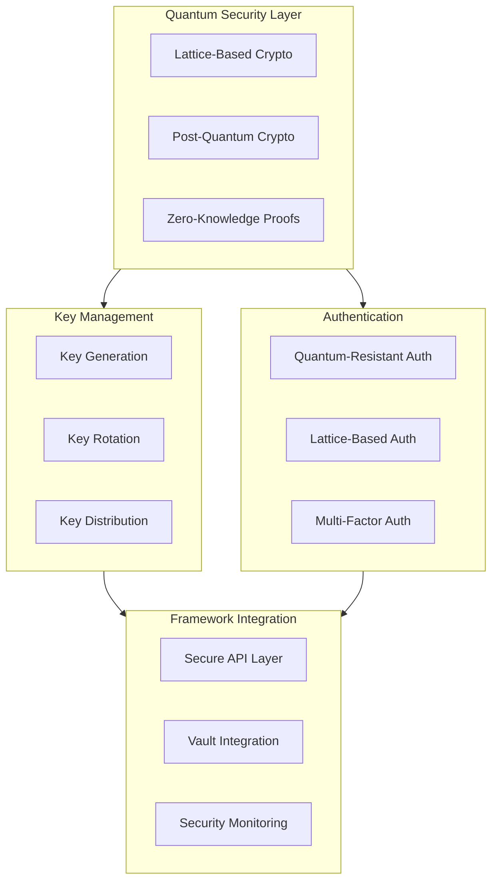

# 241213_SEC_QUANTUM_INT_v1.0_ANFL
# Quantum Security Architecture
# Security Level: Confidential
# Owner: Infrastructure Team
# Last Modified: 2024-12-13

## BLUF (Bottom Line Up Front)
Comprehensive quantum-secure architecture implementing lattice-based cryptography, post-quantum key management, and quantum-resistant authentication mechanisms for the Aeon Nova Framework. This foundational security layer ensures post-quantum security while maintaining operational efficiency and integration capabilities with existing framework components.

## System Architecture

### Core Components Overview



## Implementation Details

### 1. Lattice-Based Cryptography
```yaml
lattice_crypto:
  algorithm: CRYSTALS-Kyber
  parameters:
    dimension: 3072
    modulus: "q=3329"
  implementation:
    key_exchange:
      protocol: LWE-Based
      refresh_interval: 24h
    signatures:
      algorithm: CRYSTALS-Dilithium
      strength: 5
    zero_knowledge:
      proofs: lattice_based_zkp
      verification: blockchain_backed
```

### 2. Key Management System
```python
class QuantumKeyManager:
    """
    Quantum-resistant key management implementation
    """
    def __init__(self):
        self.crypto_engine = QuantumCrypto()
        self.vault_manager = VaultManager()
        self.blockchain = BlockchainVerification()
        
    async def generate_keys(
        self,
        key_type: str,
        security_level: int
    ) -> KeyPair:
        """Generate quantum-resistant keys"""
        try:
            # Initialize quantum-secure parameters
            params = await self.crypto_engine.get_parameters(
                security_level=security_level
            )
            
            # Generate key pair
            key_pair = await self.crypto_engine.generate_keypair(
                key_type=key_type,
                params=params
            )
            
            # Store with Vault
            await self.vault_manager.store_keys(
                key_pair=key_pair,
                metadata=self.generate_metadata()
            )
            
            # Register on blockchain
            await self.blockchain.register_keys(
                public_key=key_pair.public,
                metadata=self.generate_metadata()
            )
            
            return key_pair
            
        except Exception as e:
            await self.alert_system.raise_alert(
                level="ERROR",
                component="key_generation",
                error=e
            )
            raise
```

### 3. Authentication Framework
```yaml
authentication:
  primary_methods:
    quantum_resistant_tokens:
      algorithm: CRYSTALS-Kyber
      token_lifetime: 24h
      refresh_mechanism: sliding_window
    lattice_signatures:
      algorithm: CRYSTALS-Dilithium
      verification: blockchain_based
      
  backup_methods:
    classical_hybrid:
      algorithms:
        - RSA-4096
        - ECC-P521
      transition_period: 180d
      
  mfa_requirements:
    enabled: true
    methods:
      - quantum_resistant_otp
      - hardware_token
      - biometric
```

## Security Implementation

### 1. Quantum Security Controls
```yaml
security_controls:
  algorithms:
    encryption:
      primary: CRYSTALS-Kyber
      strength: 1024
      mode: hybrid_operation
    signatures:
      primary: CRYSTALS-Dilithium
      strength: 5
      verification: multi_party
    
  key_management:
    rotation:
      schedule: 90d
      method: quantum_resistant
      backup: secure_distributed
    
  monitoring:
    metrics:
      - quantum_operation_success
      - key_health_status
      - security_level_validation
```

### 2. Integration Points
```yaml
integration_config:
  vault_integration:
    auth_methods:
      - path: auth/quantum
        type: quantum_resistant
        config: quantum_auth.yml
      - path: auth/lattice
        type: lattice_based
        config: lattice_auth.yml
        
  monitoring_integration:
    prometheus:
      metrics_path: /quantum/metrics
      scrape_interval: 15s
    grafana:
      dashboards:
        - quantum_security_overview
        - key_management_status
        - auth_system_health
```

## Performance Optimization

### 1. Operation Benchmarks
```yaml
benchmarks:
  key_operations:
    generation:
      target_time: 100ms
      max_time: 500ms
    exchange:
      target_time: 50ms
      max_time: 200ms
    
  authentication:
    token_generation:
      target_time: 100ms
      max_time: 300ms
    verification:
      target_time: 50ms
      max_time: 150ms
```

### 2. Resource Management
```yaml
resource_allocation:
  compute:
    quantum_operations:
      min_cores: 2
      max_cores: 8
    key_management:
      min_cores: 1
      max_cores: 4
  memory:
    quantum_operations:
      min: 4GB
      max: 16GB
    key_storage:
      min: 2GB
      max: 8GB
```

## Monitoring and Alerts

### 1. Security Metrics
```yaml
metrics:
  collection:
    quantum_operations:
      - operation_success_rate
      - key_generation_time
      - verification_latency
    key_management:
      - rotation_status
      - key_health
      - backup_status
```

### 2. Alert Configuration
```yaml
alerts:
  critical:
    - name: quantum_security_breach
      condition: security_level < threshold
      threshold: immediate
    - name: key_compromise_detected
      condition: verification_failure
      threshold: immediate
  warning:
    - name: high_latency
      condition: operation_time > threshold
      threshold: 5m
    - name: key_rotation_needed
      condition: key_age > 80d
      threshold: 24h
```

## Version History

| Version | Date | Author | Changes |
|---------|------|--------|---------|
| 1.0 | 2024-12-13 | Infrastructure Team | Initial quantum security architecture |

## Appendices

### A. Implementation References
- [Quantum Security Setup](docs/quantum_security.md)
- [Key Management Procedures](docs/key_management.md)
- [Authentication Configuration](docs/authentication.md)

### B. Security Protocols
- [Key Rotation Procedures](security/key_rotation.md)
- [Emergency Response Plans](security/emergency_response.md)
- [Audit Requirements](security/audit_requirements.md)
