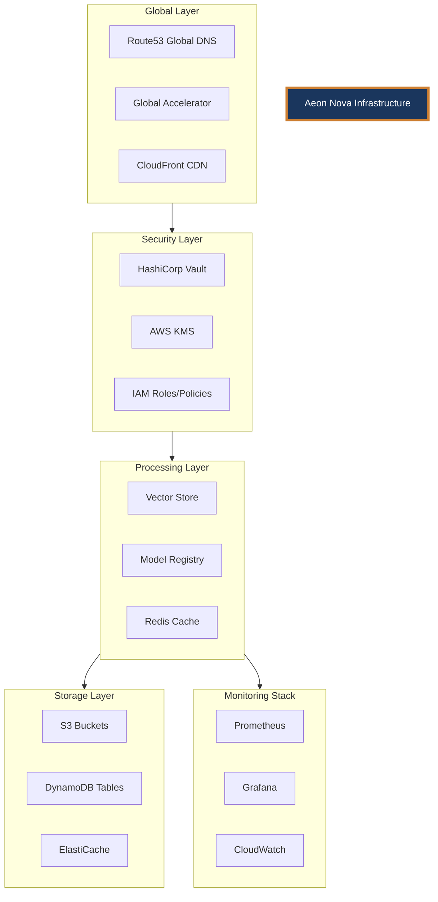
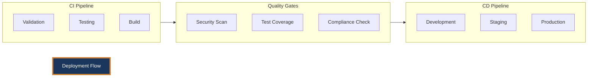

# 241213_TECH_ARCH_INT_v1.0_ANFL
# Aeon Nova Framework Library Agent - Technical Architecture
# Security Level: Confidential
# Owner: Infrastructure Team
# Last Modified: 2024-12-13

## BLUF (Bottom Line Up Front)
The Aeon Nova Framework Library Agent implements a secure, scalable infrastructure for ML model management and vector storage, featuring integrated monitoring, automated deployments, and comprehensive security controls. The system utilizes multi-region AWS infrastructure with Vault-based secret management and Prometheus/Grafana monitoring.

## System Overview

### Core Components
1. **Vector Store Integration**
   - Pinecone backend with 3072-dimension vectors
   - Redis caching layer
   - Secure credential management via Vault
   - Prometheus metrics integration

2. **Model Registry**
   - S3-based model storage with KMS encryption
   - DynamoDB metadata storage
   - ElastiCache for performance optimization
   - Lambda-based API interface

3. **Monitoring Stack**
   - Prometheus metrics collection
   - Grafana visualization
   - Custom dashboards
   - Automated alerting

### Infrastructure Architecture



## Implementation Details

### Security Implementation
```yaml
security_controls:
  authentication:
    primary: Vault AppRole
    backup: JWT tokens
  encryption:
    at_rest: AWS KMS (AES-256)
    in_transit: TLS 1.3
  access_control:
    type: Role-Based (RBAC)
    granularity: Resource-level
```

### Monitoring Configuration
```yaml
monitoring:
  metrics:
    collection_interval: 15s
    retention_period: 15d
    custom_metrics:
      - vector_processing_time
      - model_registry_operations
      - cache_hit_ratio
  alerting:
    channels:
      - slack: "#alerts"
      - email: "platform-ops@aeonova.com"
    severity_levels:
      - critical
      - warning
      - info
```

### Deployment Architecture



## Security Considerations

### Access Control Matrix
| Component       | Admin | Developer | Operator |
|----------------|--------|-----------|-----------|
| Vector Store   | Full   | Read/Write| Read      |
| Model Registry | Full   | Write     | Read      |
| Monitoring     | Full   | Read      | Full      |
| Infrastructure | Full   | None      | Read      |

### Security Controls
1. **Data Protection**
   - KMS encryption for all stored data
   - TLS 1.3 for data in transit
   - Regular key rotation

2. **Authentication**
   - Vault-based secret management
   - Role-based access control
   - JWT token authentication

3. **Audit Trail**
   - Comprehensive logging
   - Operation tracking
   - Compliance monitoring

## Monitoring Framework

### Metrics Collection
1. **System Metrics**
   - Resource utilization
   - Operation latency
   - Error rates

2. **Business Metrics**
   - Vector operations/second
   - Model deployment frequency
   - Cache hit ratios

### Alert Configuration
```yaml
alerts:
  high_priority:
    - error_rate_exceeded
    - system_health_critical
    - security_breach_detected
  medium_priority:
    - high_latency_detected
    - cache_miss_ratio_high
    - resource_utilization_high
```

## Version History

| Version | Date     | Author | Changes                                   |
|---------|----------|--------|-------------------------------------------|
| 1.0     | 2024-12-13| Infrastructure Team | Initial architecture documentation |

## Next Steps

### Immediate Tasks
1. Complete Vault policy implementation
2. Deploy monitoring dashboards
3. Implement backup procedures

### Future Enhancements
1. Multi-region replication
2. Advanced caching strategies
3. Enhanced security monitoring

## Appendices

### A. Reference Documentation
- [Vault Configuration Guide](docs/vault_config.md)
- [Monitoring Setup Guide](docs/monitoring_setup.md)
- [Security Procedures](docs/security_procedures.md)

### B. Configuration Templates
- [Terraform Modules](terraform/modules/)
- [Vault Policies](vault/policies/)
- [Monitoring Rules](monitoring/rules/)