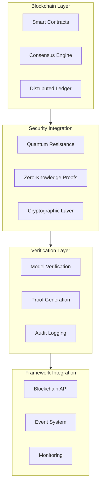

# 241213_TECH_BLOCKCHAIN_INT_v1.0_ANFL
# Blockchain Integration Framework
# Security Level: Confidential
# Owner: Infrastructure Team
# Last Modified: 2024-12-13

## BLUF (Bottom Line Up Front)
Comprehensive blockchain integration framework implementing quantum-resistant smart contracts, distributed consensus mechanisms, and secure verification protocols for the Aeon Nova Framework. This integration ensures immutable audit trails and verifiable model provenance while maintaining quantum security compliance.

## System Architecture

### Core Components Overview



## Implementation Details

### 1. Smart Contract Framework
```solidity
// Core verification contract with quantum security
contract QuantumVerification {
    using QuantumCrypto for bytes32;
    
    struct VerificationRecord {
        bytes32 dataHash;
        bytes32 quantumProof;
        uint256 timestamp;
        address verifier;
    }
    
    mapping(bytes32 => VerificationRecord) public verifications;
    
    event DataVerified(
        bytes32 indexed dataHash,
        bytes32 quantumProof,
        uint256 timestamp
    );
    
    function verifyData(
        bytes32 dataHash,
        bytes32 quantumProof
    ) public {
        require(
            dataHash.verifyQuantumProof(quantumProof),
            "Invalid quantum proof"
        );
        
        verifications[dataHash] = VerificationRecord({
            dataHash: dataHash,
            quantumProof: quantumProof,
            timestamp: block.timestamp,
            verifier: msg.sender
        });
        
        emit DataVerified(
            dataHash,
            quantumProof,
            block.timestamp
        );
    }
}
```

### 2. Consensus Implementation
```yaml
consensus_mechanism:
  type: quantum_resistant_pos
  parameters:
    min_validators: 32
    epoch_length: 900
    block_time: 15
    
  verification:
    methods:
      - lattice_based_signatures
      - zero_knowledge_proofs
      - quantum_resistant_hashing
    
  validator_requirements:
    stake: 32 ETH
    uptime: 99.9%
    security_level: quantum_resistant
```

### 3. Blockchain Integration Service
```python
class BlockchainIntegrationService:
    """
    Manages blockchain integration with quantum security
    """
    def __init__(self):
        self.quantum_crypto = QuantumCrypto()
        self.smart_contracts = SmartContractManager()
        self.consensus = ConsensusEngine()
        
    async def verify_data(
        self,
        data: bytes,
        security_level: int
    ) -> VerificationResult:
        """Execute quantum-secure data verification"""
        try:
            # Generate quantum-resistant hash
            data_hash = await self.quantum_crypto.generate_hash(
                data=data,
                security_level=security_level
            )
            
            # Create quantum proof
            quantum_proof = await self.quantum_crypto.generate_proof(
                data_hash=data_hash,
                security_params=self.get_security_params()
            )
            
            # Submit to blockchain
            tx_hash = await self.smart_contracts.verify_data(
                data_hash=data_hash,
                quantum_proof=quantum_proof
            )
            
            # Wait for consensus
            verification = await self.consensus.wait_for_confirmation(
                tx_hash=tx_hash,
                confirmations=self.get_required_confirmations()
            )
            
            return VerificationResult(
                verified=True,
                proof=quantum_proof,
                transaction=tx_hash,
                consensus=verification
            )
            
        except Exception as e:
            await self.alert_system.raise_alert(
                level="ERROR",
                component="blockchain_verification",
                error=e
            )
            raise
```

## Security Implementation

### 1. Quantum Security Integration
```yaml
quantum_security:
  blockchain_protection:
    contracts:
      verification: quantum_resistant
      signature: lattice_based
    consensus:
      algorithm: quantum_pos
      protection: post_quantum
      
  key_management:
    type: hierarchical_quantum
    rotation: 90d
    backup: distributed_secure
```

### 2. Verification Protocols
```yaml
verification_protocols:
  model_verification:
    methods:
      - quantum_hash_verification
      - lattice_signature_check
      - zero_knowledge_validation
    requirements:
      proof_generation: mandatory
      consensus_confirmation: required
      audit_logging: enabled
      
  data_integrity:
    checks:
      - hash_verification
      - quantum_resistance
      - timestamp_validation
    frequency: per_block
```

## Performance Optimization

### 1. Transaction Processing
```yaml
transaction_processing:
  optimization:
    batch_size: 100
    max_gas: 8000000
    priority: medium
    
  caching:
    verification_results: 1h
    proof_cache: 24h
    consensus_state: 15m
```

### 2. Resource Management
```yaml
resource_allocation:
  nodes:
    validator:
      cpu: 4
      memory: 16GB
      storage: 1TB
    verification:
      cpu: 2
      memory: 8GB
      storage: 500GB
```

## Monitoring Integration

### 1. Blockchain Metrics
```yaml
metrics:
  collection:
    consensus:
      - validator_status
      - block_production
      - network_participation
    verification:
      - proof_generation_time
      - verification_success_rate
      - quantum_security_level
```

### 2. Alert Configuration
```yaml
alerts:
  critical:
    - name: consensus_failure
      condition: participation < 66%
      threshold: immediate
    - name: verification_breach
      condition: security_level < minimum
      threshold: immediate
  warning:
    - name: high_latency
      condition: verification_time > 5s
      threshold: 5m
    - name: resource_pressure
      condition: usage > 80%
      threshold: 15m
```

## Version History

| Version | Date | Author | Changes |
|---------|------|--------|---------|
| 1.0 | 2024-12-13 | Infrastructure Team | Initial blockchain integration framework |

## Appendices

### A. Implementation References
- [Smart Contract Guide](docs/smart_contracts.md)
- [Consensus Configuration](docs/consensus.md)
- [Verification Protocols](docs/verification.md)

### B. Security Protocols
- [Quantum Security Integration](security/quantum_integration.md)
- [Key Management](security/key_management.md)
- [Audit Procedures](security/audit.md)
