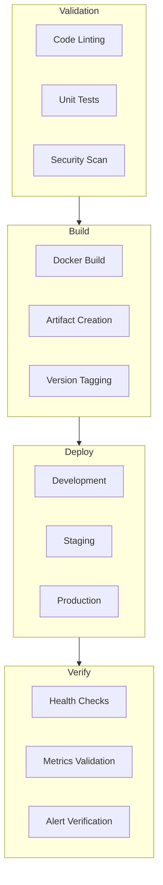

# 241213_TECH_CICD_INT_v1.0_ANFL
# Aeon Nova Framework Library Agent - CI/CD Pipeline
# Security Level: Confidential
# Owner: Infrastructure Team
# Last Modified: 2024-12-13

## BLUF (Bottom Line Up Front)
Comprehensive CI/CD pipeline implementation for the Aeon Nova Framework Library Agent, ensuring secure, automated, and consistent deployments across all environments with proper validation and monitoring.

## Pipeline Architecture

### Overview



## Pipeline Configuration

### GitHub Actions Workflow
```yaml
name: Aeon Nova CI/CD Pipeline

on:
  push:
    branches: [main, develop]
  pull_request:
    branches: [main, develop]

jobs:
  validate:
    runs-on: ubuntu-latest
    steps:
      - name: Checkout code
        uses: actions/checkout@v4

      - name: Setup Python
        uses: actions/setup-python@v4
        with:
          python-version: '3.9'

      - name: Run linting and tests
        run: |
          pip install -r requirements-dev.txt
          black --check .
          pylint src/
          pytest tests/

  security_scan:
    needs: validate
    runs-on: ubuntu-latest
    steps:
      - name: Security scan
        uses: aquasecurity/trivy-action@master
        with:
          scan-type: 'fs'
          security-checks: 'vuln,config,secret'
          severity: 'CRITICAL,HIGH'

  build:
    needs: security_scan
    runs-on: ubuntu-latest
    steps:
      - name: Build Docker image
        run: docker build -t aeonova/library-agent:${{ github.sha }} .

      - name: Push to registry
        run: |
          docker login -u ${{ secrets.DOCKER_USER }} -p ${{ secrets.DOCKER_TOKEN }}
          docker push aeonova/library-agent:${{ github.sha }}

  deploy_dev:
    needs: build
    runs-on: ubuntu-latest
    environment: development
    steps:
      - name: Deploy to dev
        uses: aws-actions/amazon-ecs-deploy-task-definition@v1
        with:
          task-definition: task-definition.json
          service: library-agent-dev
          cluster: aeonova-dev

  deploy_staging:
    needs: deploy_dev
    runs-on: ubuntu-latest
    environment: staging
    steps:
      - name: Deploy to staging
        uses: aws-actions/amazon-ecs-deploy-task-definition@v1
        with:
          task-definition: task-definition.json
          service: library-agent-staging
          cluster: aeonova-staging

  deploy_prod:
    needs: deploy_staging
    runs-on: ubuntu-latest
    environment: production
    steps:
      - name: Deploy to production
        uses: aws-actions/amazon-ecs-deploy-task-definition@v1
        with:
          task-definition: task-definition.json
          service: library-agent-prod
          cluster: aeonova-prod
```

## Environment Configuration

### Development Environment
```yaml
environment:
  name: development
  auto_deploy: true
  monitoring:
    prometheus:
      retention: 7d
      scrape_interval: 15s
    alerts:
      slack_channel: "#dev-alerts"
  scaling:
    min_capacity: 1
    max_capacity: 2
```

### Staging Environment
```yaml
environment:
  name: staging
  auto_deploy: false
  approvers: [team-lead]
  monitoring:
    prometheus:
      retention: 15d
      scrape_interval: 15s
    alerts:
      slack_channel: "#staging-alerts"
  scaling:
    min_capacity: 2
    max_capacity: 4
```

### Production Environment
```yaml
environment:
  name: production
  auto_deploy: false
  approvers: [cto]
  monitoring:
    prometheus:
      retention: 30d
      scrape_interval: 15s
    alerts:
      slack_channel: "#prod-alerts"
      pagerduty: true
  scaling:
    min_capacity: 3
    max_capacity: 10
```

## Security Integration

### Vault Integration
```yaml
vault_integration:
  auth_method: jwt
  policies:
    - deployment-secrets
    - monitoring-config
  secret_engines:
    - kv-v2
    - transit
```

### Security Checks
```yaml
security_checks:
  static_analysis:
    - bandit
    - safety
    - snyk
  container_scanning:
    - trivy
    - clair
  dependency_check:
    - safety
    - pip-audit
```

## Monitoring Integration

### Deployment Metrics
```yaml
metrics:
  deployment:
    - deployment_duration
    - success_rate
    - rollback_rate
  performance:
    - response_time
    - error_rate
    - resource_usage
```

### Alert Configuration
```yaml
alerts:
  deployment:
    - name: deployment_failed
      severity: critical
      channels: [slack, email]
    - name: high_error_rate
      severity: warning
      threshold: 5%
      window: 5m
```

## Version History

| Version | Date | Author | Changes |
|---------|------|--------|---------|
| 1.0 | 2024-12-13 | Infrastructure Team | Initial CI/CD pipeline documentation |

## Appendices

### A. Pipeline Scripts
```bash
#!/bin/bash
# deployment.sh
source .env
terraform init
terraform plan -out=tfplan
terraform apply tfplan
```

### B. Configuration Templates
- [Task Definition Template](templates/task-definition.json)
- [Container Definition Template](templates/container-definition.json)
- [Service Definition Template](templates/service-definition.json)