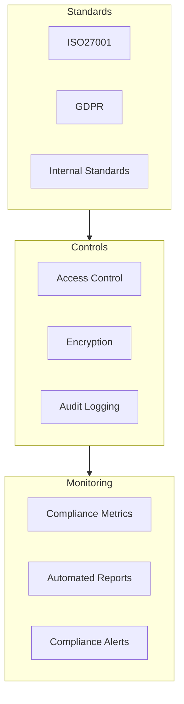

# 241213_TECH_COMPLIANCE_INT_v1.0_ANFL
# Aeon Nova Framework Library Agent - Compliance Framework
# Security Level: Confidential
# Owner: Infrastructure Team
# Last Modified: 2024-12-13

## BLUF (Bottom Line Up Front)
Comprehensive compliance framework ensuring adherence to ISO27001, GDPR, and internal security standards while maintaining operational efficiency and data protection requirements for the Aeon Nova Framework Library Agent.

## Compliance Architecture

### Overview



## ISO27001 Implementation

### Access Control Implementation
```yaml
access_control:
  policies:
    - name: role_based_access
      type: mandatory
      controls:
        - user_registration
        - privilege_management
        - password_management
        - access_review
      review_frequency: quarterly

  authentication:
    primary: 
      method: vault_approle
      rotation: 90d
    secondary:
      method: jwt_token
      expiration: 24h

  authorization:
    model: RBAC
    roles:
      - admin
      - developer
      - operator
      - auditor
```

### Information Security
```yaml
information_security:
  data_classification:
    levels:
      - confidential:
          encryption: required
          access: restricted
          audit: full
      - internal:
          encryption: required
          access: role-based
          audit: selective
      - public:
          encryption: optional
          access: authenticated
          audit: minimal

  cryptography:
    algorithms:
      symmetric: AES-256-GCM
      asymmetric: RSA-4096
    key_management:
      rotation: 90d
      backup: encrypted
      storage: hardware_security_module
```

## GDPR Compliance

### Data Protection Measures
```yaml
data_protection:
  personal_data:
    identification:
      - name
      - email
      - ip_address
    handling:
      encryption: mandatory
      retention: specified
      access_logging: enabled

  processing_records:
    documentation:
      - purpose
      - categories
      - recipients
      - safeguards
    review:
      frequency: quarterly
      approver: dpo
```

### Rights Implementation
```yaml
data_subject_rights:
  supported_rights:
    - right_to_access:
        implementation: api_endpoint
        response_time: 30d
    - right_to_rectification:
        implementation: admin_portal
        verification: required
    - right_to_erasure:
        implementation: automated_workflow
        backup_cleanup: included
```

## Audit Framework

### Audit Trail Configuration
```yaml
audit_logging:
  storage:
    type: encrypted_s3
    retention: 7y
    backup: cross_region

  events:
    authentication:
      - login_attempts
      - password_changes
      - role_changes
    data_access:
      - read_operations
      - write_operations
      - delete_operations
    compliance:
      - policy_changes
      - permission_updates
      - data_exports
```

### Monitoring Setup
```yaml
compliance_monitoring:
  metrics:
    collection:
      interval: 5m
      retention: 365d
    categories:
      - access_control
      - data_protection
      - security_events

  alerts:
    definitions:
      - name: unauthorized_access
        severity: critical
        threshold: immediate
      - name: encryption_failure
        severity: critical
        threshold: immediate
      - name: compliance_violation
        severity: high
        threshold: 5m
```

## Security Controls

### Encryption Standards
```yaml
encryption_framework:
  data_at_rest:
    method: AES-256-GCM
    key_rotation: 90d
    storage: vault_transit

  data_in_transit:
    method: TLS_1.3
    certificate_management: automated
    validation: strict

  key_management:
    storage: hsm
    backup: encrypted
    access: restricted
```

### Access Management
```yaml
access_management:
  authentication:
    primary: vault_approle
    secondary: jwt
    mfa: required

  authorization:
    model: rbac
    roles:
      admin:
        permissions: [create, read, update, delete]
        scope: [all_resources]
      operator:
        permissions: [read, update]
        scope: [assigned_resources]
```

## Compliance Reporting

### Automated Reports
```yaml
reporting:
  schedules:
    daily:
      - access_logs
      - security_events
    weekly:
      - compliance_metrics
      - policy_changes
    monthly:
      - audit_summary
      - risk_assessment

  distribution:
    method: encrypted_email
    recipients:
      - security_team
      - compliance_officer
      - auditors
```

### Compliance Metrics
```yaml
metrics:
  collection:
    interval: 15m
    retention: 1y
    storage: secure_tsdb

  categories:
    security:
      - access_attempts
      - authorization_failures
      - encryption_status
    compliance:
      - gdpr_violations
      - policy_breaches
      - data_access_patterns
```

## Version History

| Version | Date | Author | Changes |
|---------|------|--------|---------|
| 1.0 | 2024-12-13 | Infrastructure Team | Initial compliance framework |

## Appendices

### A. Compliance Procedures
- [Access Control Procedures](docs/procedures/access_control.md)
- [Data Protection Procedures](docs/procedures/data_protection.md)
- [Audit Procedures](docs/procedures/audit.md)

### B. Reference Documentation
- [ISO27001 Controls Matrix](docs/compliance/iso27001_matrix.md)
- [GDPR Requirements Mapping](docs/compliance/gdpr_mapping.md)
- [Internal Security Standards](docs/compliance/internal_standards.md)