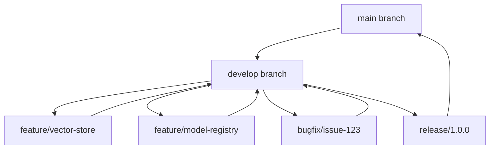

# 241213_TECH_DEVGUIDE_INT_v1.0_ANFL
# Aeon Nova Framework Library Agent - Development Guidelines
# Security Level: Confidential
# Owner: Infrastructure Team
# Last Modified: 2024-12-13

## BLUF (Bottom Line Up Front)
This document outlines the comprehensive development standards, workflows, and best practices for the Aeon Nova Framework Library Agent. It ensures consistent, secure, and maintainable code development aligned with framework requirements and industry best practices.

## Development Environment Setup

### Local Environment Configuration
```yaml
environment:
  python:
    version: "3.9"
    virtual_env: true
    requirements:
      - requirements.txt
      - requirements-dev.txt
  
  tools:
    required:
      - terraform: "~> 1.6.0"
      - vault: "~> 1.13.0"
      - docker: "latest"
      - pre-commit: "latest"
    
  ide_setup:
    vscode:
      extensions:
        - ms-python.python
        - hashicorp.terraform
        - davidanson.vscode-markdownlint
```

### Initial Setup Commands
```bash
# Clone repository and set up environment
git clone https://github.com/aeonnovafuturelabs/AEONNOVAPROJECT.git
cd AEONNOVAPROJECT

# Create virtual environment
python -m venv venv
source venv/bin/activate

# Install dependencies
pip install -r requirements.txt
pip install -r requirements-dev.txt

# Initialize pre-commit hooks
pre-commit install

# Configure Vault for local development
export VAULT_ADDR="http://127.0.0.1:8200"
export VAULT_TOKEN="root"
```

## Code Standards

### Python Style Guide
```yaml
style_guide:
  formatting:
    line_length: 88
    indentation: 4 spaces
    quotes: double
  
  tools:
    - black
    - isort
    - flake8
    - mypy
  
  docstrings:
    style: Google
    required_sections:
      - Args
      - Returns
      - Raises
```

### Commit Message Format
```yaml
commit_format:
  structure: "{type}({scope}): {description}"
  types:
    - feat: New features
    - fix: Bug fixes
    - docs: Documentation
    - style: Formatting
    - refactor: Code restructuring
    - test: Testing
    - chore: Maintenance
  
  example: "feat(vector-store): implement vector similarity search"
```

## Development Workflow

### Branch Strategy



### Code Review Process
```yaml
review_process:
  required_approvers: 2
  required_checks:
    - unit-tests
    - integration-tests
    - security-scan
    - lint-checks
  
  checklist:
    - code_quality
    - test_coverage
    - documentation
    - security_compliance
```

## Testing Standards

### Test Structure
```python
# Example test structure
def test_vector_store_operations():
    """
    Test vector store operations following standard pattern.
    
    Arrange:
        - Initialize vector store
        - Prepare test data
    
    Act:
        - Perform vector operations
    
    Assert:
        - Verify results
        - Check error cases
    """
    # Test implementation
```

### Coverage Requirements
```yaml
coverage:
  minimum:
    total: 80%
    critical_paths: 95%
  
  report_formats:
    - xml
    - html
    - console
  
  excluded_paths:
    - tests/*
    - setup.py
```

## Security Guidelines

### Secret Management
```yaml
secrets_handling:
  vault:
    auth_method: approle
    paths:
      development: secret/dev/*
      staging: secret/staging/*
      production: secret/prod/*
  
  rules:
    - no_hardcoded_secrets
    - use_environment_variables
    - rotate_credentials_regularly
```

### Code Security
```yaml
security_checks:
  static_analysis:
    - bandit
    - safety
    - snyk
  
  dependency_scanning:
    - safety check
    - pip-audit
  
  container_scanning:
    - trivy
    - clair
```

## CI/CD Pipeline

### Pipeline Configuration
```yaml
pipeline:
  stages:
    validate:
      - lint
      - format
      - type-check
    
    test:
      - unit-tests
      - integration-tests
      - security-tests
    
    build:
      - docker-build
      - terraform-plan
    
    deploy:
      - terraform-apply
      - post-deploy-tests
```

### Deployment Process
```yaml
deployment:
  environments:
    dev:
      auto_deploy: true
      required_checks: minimal
    
    staging:
      auto_deploy: false
      required_checks: standard
      approvers: team-lead
    
    prod:
      auto_deploy: false
      required_checks: strict
      approvers: cto
```

## Monitoring Integration

### Development Metrics
```yaml
metrics:
  collection:
    - code_quality_metrics
    - test_coverage_metrics
    - build_success_rate
    - deployment_frequency
  
  visualization:
    dashboard: "Development Metrics"
    refresh_rate: 5m
```

### Logging Standards
```yaml
logging:
  level: DEBUG
  format: |
    timestamp=%(asctime)s
    level=%(levelname)s
    logger=%(name)s
    message=%(message)s
  
  required_fields:
    - timestamp
    - level
    - service
    - trace_id
```

## Documentation Requirements

### Code Documentation
```yaml
documentation:
  required:
    - module_docstrings
    - function_docstrings
    - type_hints
    - examples
  
  format:
    style: Google
    sections:
      - Args
      - Returns
      - Raises
      - Examples
```

### API Documentation
```yaml
api_docs:
  format: OpenAPI 3.0
  required_sections:
    - endpoint_description
    - request_parameters
    - response_schema
    - error_codes
  
  generation:
    tool: sphinx-autoapi
    output: docs/api
```

## Version History

| Version | Date     | Author | Changes                               |
|---------|----------|--------|---------------------------------------|
| 1.0     | 2024-12-13| Development Team | Initial development guidelines |

## Appendices

### A. Tools Reference
- [Development Tools](docs/tools/development.md)
- [Testing Tools](docs/tools/testing.md)
- [Security Tools](docs/tools/security.md)

### B. Templates
- [Code Templates](templates/code/)
- [Documentation Templates](templates/docs/)
- [Pipeline Templates](templates/pipelines/)