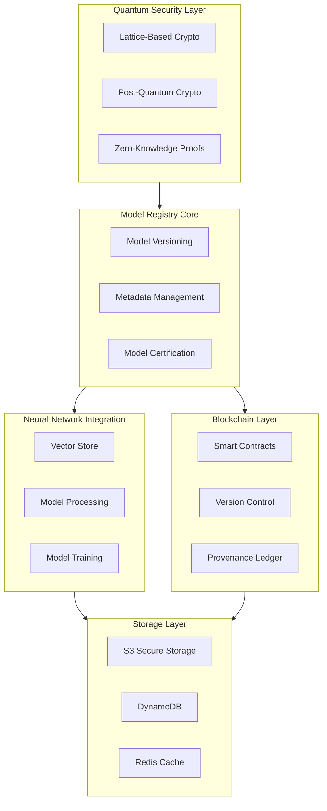

# 241213_TECH_MODEL_INT_v1.0_ANFL
# Enhanced Model Registry with Quantum Security
# Security Level: Confidential
# Owner: Infrastructure Team
# Last Modified: 2024-12-13

## BLUF (Bottom Line Up Front)
Comprehensive implementation of a quantum-secure model registry system integrating lattice-based cryptography, blockchain verification, and neural network capabilities. The system ensures post-quantum security while maintaining high performance and scalability requirements.

## System Architecture

### Component Overview



### Implementation Details

1. Quantum-Secure Layer
```yaml
quantum_security:
  lattice_crypto:
    algorithm: CRYSTALS-Kyber
    parameters:
      dimension: 3072
      modulus: "q=3329"
    key_exchange:
      protocol: LWE-Based
      refresh_interval: 24h

  zero_knowledge_proofs:
    type: quantum_resistant
    protocols:
      - ownership_proof
      - access_verification
      - model_authenticity
```

2. Neural Network Integration
```yaml
neural_network:
  vector_processing:
    embedding_dimension: 3072
    quantization:
      method: product_quantization
      bits_per_component: 8
    
  model_evaluation:
    metrics:
      - accuracy
      - latency
      - resource_usage
    validation:
      cross_validation: 5
      test_split: 0.2
```

3. Blockchain Integration
```solidity
// Model Registry Smart Contract
contract ModelRegistry {
    struct ModelVersion {
        bytes32 modelHash;
        bytes32 vectorHash;
        uint256 timestamp;
        address owner;
        string version;
        string metadata;
    }

    mapping(bytes32 => ModelVersion) public models;
    
    event ModelRegistered(
        bytes32 indexed modelHash,
        address indexed owner,
        string version
    );

    function registerModel(
        bytes32 modelHash,
        bytes32 vectorHash,
        string memory version,
        string memory metadata
    ) public {
        models[modelHash] = ModelVersion({
            modelHash: modelHash,
            vectorHash: vectorHash,
            timestamp: block.timestamp,
            owner: msg.sender,
            version: version,
            metadata: metadata
        });
        
        emit ModelRegistered(modelHash, msg.sender, version);
    }
}
```

## Implementation Strategy

### Model Storage Implementation
```python
class QuantumSecureModelStorage:
    """
    Manages model storage with quantum-secure encryption
    """
    def __init__(self):
        self.quantum_crypto = QuantumCrypto()
        self.blockchain = BlockchainManager()
        self.vector_store = VectorStore()
        
    async def store_model(
        self,
        model: Model,
        metadata: Dict,
        vector_data: np.ndarray
    ) -> Dict[str, str]:
        """Store model with quantum-secure encryption"""
        # Quantum-secure encryption
        encrypted_model = await self.quantum_crypto.encrypt(model)
        
        # Generate vector embedding
        vector_hash = await self.vector_store.store(vector_data)
        
        # Store in S3 with encryption
        model_hash = await self.s3.store(
            encrypted_model,
            encryption='quantum_resistant'
        )
        
        # Register on blockchain
        tx_hash = await self.blockchain.register_model(
            model_hash=model_hash,
            vector_hash=vector_hash,
            metadata=metadata
        )
        
        return {
            'model_hash': model_hash,
            'vector_hash': vector_hash,
            'tx_hash': tx_hash
        }
```

### Neural Network Processing
```python
class NeuralProcessor:
    """
    Handles neural network processing and optimization
    """
    def __init__(self):
        self.embedding_model = EmbeddingModel()
        self.optimizer = ModelOptimizer()
        self.validator = ModelValidator()
        
    async def process_model(
        self,
        model: NeuralNetwork,
        config: ProcessingConfig
    ) -> ProcessedModel:
        """Process neural network model"""
        # Generate embeddings
        embeddings = await self.embedding_model.generate(model)
        
        # Optimize model
        optimized = await self.optimizer.optimize(
            model,
            strategy='quantum_aware'
        )
        
        # Validate model
        validation = await self.validator.validate(
            model=optimized,
            embeddings=embeddings
        )
        
        return ProcessedModel(
            model=optimized,
            embeddings=embeddings,
            validation=validation
        )
```

## Security Implementation

### Quantum Security Controls
```yaml
security_controls:
  quantum_resistance:
    encryption:
      algorithm: Kyber1024
      key_rotation: 90d
    signatures:
      algorithm: CRYSTALS-Dilithium
      strength: 5
    
  blockchain_security:
    consensus: quantum_resistant_pos
    validation:
      nodes: minimum_32
      threshold: 2f + 1
```

### Access Control
```yaml
access_management:
  authentication:
    primary: quantum_resistant_tokens
    backup: lattice_based_signatures
  
  authorization:
    model: rbac
    quantum_verification: true
    blockchain_validation: true
```

## Monitoring Integration

### Performance Metrics
```yaml
metrics_collection:
  model_operations:
    - storage_latency
    - retrieval_time
    - verification_duration
  
  quantum_security:
    - encryption_performance
    - key_generation_time
    - signature_verification
```

### Alert Configuration
```yaml
alerting:
  rules:
    - name: quantum_security_breach
      severity: critical
      threshold: immediate
    - name: model_verification_failure
      severity: high
      threshold: 5m
```

## Version History

| Version | Date | Author | Changes |
|---------|------|--------|---------|
| 1.0 | 2024-12-13 | Infrastructure Team | Initial model registry implementation |

## Appendices

### A. Implementation References
- [Quantum Security Setup](docs/quantum_security.md)
- [Neural Network Integration](docs/neural_network.md)
- [Blockchain Configuration](docs/blockchain_setup.md)

### B. Security Protocols
- [Quantum Security Procedures](security/quantum_security.md)
- [Model Verification Process](security/model_verification.md)
- [Access Control Implementation](security/access_control.md)