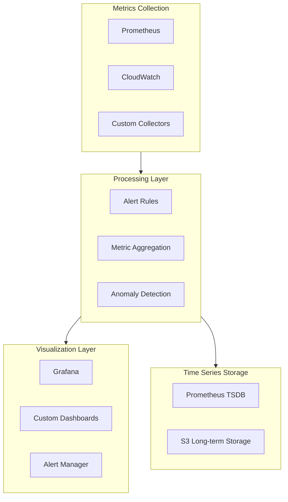

# 241213_TECH_MONITOR_INT_v1.0_ANFL
# Aeon Nova Framework Library Agent - Monitoring and Observability
# Security Level: Confidential
# Owner: Infrastructure Team
# Last Modified: 2024-12-13

## BLUF (Bottom Line Up Front)
This document outlines the comprehensive monitoring and observability implementation for the Aeon Nova Framework Library Agent, integrating Prometheus, Grafana, and CloudWatch with custom metric collection and alerting mechanisms aligned with the framework's requirements.

## Monitoring Architecture

### System Overview



## Implementation Details

### Metric Collection Configuration
```yaml
prometheus:
  global:
    scrape_interval: 15s
    evaluation_interval: 15s
    scrape_timeout: 10s
  retention:
    time: 15d
    size: 500GB
  storage:
    tsdb:
      path: /var/lib/prometheus
      retention.time: 15d
      retention.size: 500GB

metrics:
  custom_collectors:
    - name: vector_operations
      type: counter
      labels: [operation, status]
    - name: model_processing
      type: histogram
      buckets: [0.1, 0.5, 1, 2, 5]
    - name: system_health
      type: gauge
```

### Alert Rules Configuration
```yaml
alert_rules:
  vector_store:
    - name: high_error_rate
      expr: |
        rate(vector_store_errors_total[5m]) 
        / rate(vector_store_operations_total[5m]) 
        > 0.05
      for: 5m
      labels:
        severity: critical
      annotations:
        summary: High vector store error rate
        description: Error rate exceeds 5% threshold

    - name: slow_operation_duration
      expr: |
        histogram_quantile(0.95, 
          rate(vector_operation_duration_seconds_bucket[5m])
        ) > 2
      for: 5m
      labels:
        severity: warning

  system_resources:
    - name: high_memory_usage
      expr: container_memory_usage_bytes{container=~"vector-store|model-registry"} 
            > 0.85 * container_spec_memory_limit_bytes
      for: 10m
      labels:
        severity: warning
```

### Dashboard Configuration
```yaml
grafana:
  dashboards:
    vector_operations:
      title: "Vector Store Operations"
      refresh: 1m
      panels:
        - title: "Operation Rate"
          type: graph
          targets:
            - expr: rate(vector_store_operations_total[5m])
              legendFormat: "{{operation}}"
        - title: "Error Rate"
          type: graph
          targets:
            - expr: rate(vector_store_errors_total[5m])
              legendFormat: "{{error_type}}"

    system_health:
      title: "System Health Overview"
      refresh: 30s
      panels:
        - title: "Resource Usage"
          type: gauge
          targets:
            - expr: avg(container_memory_usage_bytes)
              legendFormat: "Memory Usage"
```

## Observability Implementation

### Logging Configuration
```yaml
logging:
  format: |
    timestamp=%(asctime)s 
    level=%(levelname)s 
    logger=%(name)s 
    trace_id=%(trace_id)s 
    message=%(message)s
  handlers:
    console:
      level: INFO
      format: structured
    file:
      level: DEBUG
      format: json
      path: /var/log/librarian-agent/
  retention:
    console: 7d
    file: 30d
```

### Trace Collection
```yaml
tracing:
  service_name: librarian-agent
  sample_rate: 0.1
  exporters:
    jaeger:
      endpoint: http://jaeger:14268/api/traces
    otlp:
      endpoint: https://otlp.monitoring:4317
  attributes:
    environment: ${ENV}
    version: ${VERSION}
```

### Health Checks
```yaml
health_checks:
  endpoints:
    - name: vector_store
      path: /health/vector-store
      interval: 30s
      timeout: 5s
    - name: model_registry
      path: /health/model-registry
      interval: 30s
      timeout: 5s
  thresholds:
    response_time: 500ms
    error_rate: 1%
```

## Alert Management

### Notification Channels
```yaml
notifications:
  channels:
    slack:
      webhook: ${SLACK_WEBHOOK_URL}
      default_channel: "#alerts"
      urgent_channel: "#alerts-urgent"
    email:
      smtp_server: ${SMTP_SERVER}
      from: alerts@aeonova.com
      to: platform-ops@aeonova.com
    pagerduty:
      service_key: ${PAGERDUTY_KEY}
      escalation_policy: P123ABC
```

### Escalation Procedures
```yaml
escalations:
  policies:
    - name: critical_alerts
      steps:
        - team: platform-ops
          timeout: 15m
        - team: lead-engineer
          timeout: 30m
        - team: management
          timeout: 1h
    - name: warning_alerts
      steps:
        - team: platform-ops
          timeout: 1h
        - team: lead-engineer
          timeout: 4h
```

## Long-term Storage

### Metric Retention
```yaml
storage:
  prometheus:
    local:
      retention_time: 15d
      retention_size: 500GB
    remote:
      endpoint: thanos-sidecar:19291
      retention: 1y
  logs:
    type: s3
    bucket: logs-${ENV}
    retention: 1y
    encryption: AES256
```

### Backup Configuration
```yaml
backups:
  metrics:
    frequency: daily
    retention: 90d
    type: snapshot
  dashboards:
    frequency: weekly
    retention: 1y
    type: json
```

## Version History

| Version | Date     | Author | Changes                               |
|---------|----------|--------|---------------------------------------|
| 1.0     | 2024-12-13| Infrastructure Team | Initial monitoring documentation |

## Appendices

### A. Metric Reference
- [Vector Store Metrics](../docs/metrics/vector_store.md)
- [Model Registry Metrics](../docs/metrics/model_registry.md)
- [System Metrics](../docs/metrics/system.md)

### B. Dashboard Templates
- [Operations Dashboard](../grafana/dashboards/operations.json)
- [System Health Dashboard](../grafana/dashboards/health.json)
- [Security Dashboard](../grafana/dashboards/security.json)