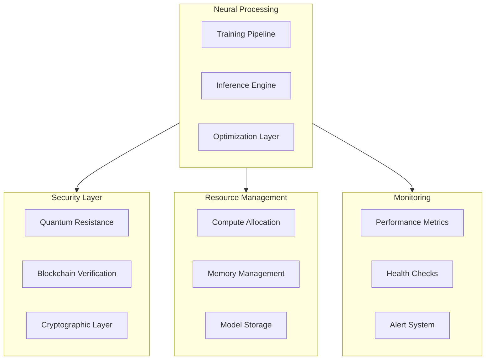

# 241213_TECH_NEURAL_INT_v1.0_ANFL
# Neural Network Implementation
# Security Level: Confidential
# Owner: Infrastructure Team
# Last Modified: 2024-12-13

## BLUF (Bottom Line Up Front)
Comprehensive neural network implementation framework integrating quantum-secure training pipelines, blockchain-verified model management, and optimized inference capabilities for the Aeon Nova Framework. This implementation ensures post-quantum security while maintaining high performance and scalability requirements.

## System Architecture

### Core Components Overview



## Implementation Details

### 1. Training Pipeline
```python
class QuantumSecureTraining:
    """
    Quantum-secure neural network training implementation
    """
    def __init__(self):
        self.quantum_crypto = QuantumCrypto()
        self.blockchain = BlockchainVerification()
        self.model_registry = ModelRegistry()
        
    async def train_model(
        self,
        model: NeuralNetwork,
        data: DataLoader,
        config: TrainingConfig
    ) -> TrainingResult:
        """Execute quantum-secure model training"""
        try:
            # Secure data preparation
            encrypted_data = await self.quantum_crypto.encrypt_training_data(
                data=data,
                security_level=config.security_level
            )
            
            # Initialize training state
            training_state = await self.initialize_training_state(
                model=model,
                config=config
            )
            
            # Training loop with quantum security
            for epoch in range(config.epochs):
                # Forward pass with secure computation
                outputs = await self.secure_forward_pass(
                    model=model,
                    data=encrypted_data
                )
                
                # Backward pass with gradient protection
                gradients = await self.secure_backward_pass(
                    outputs=outputs,
                    targets=encrypted_data.targets
                )
                
                # Quantum-secure parameter updates
                await self.update_parameters(
                    model=model,
                    gradients=gradients,
                    optimizer=config.optimizer
                )
                
                # Verify training state on blockchain
                await self.blockchain.verify_training_state(
                    model_hash=model.hash,
                    epoch_hash=self.compute_epoch_hash(epoch)
                )
            
            # Register trained model
            model_id = await self.model_registry.register_model(
                model=model,
                training_config=config,
                verification=self.blockchain.get_verification()
            )
            
            return TrainingResult(
                model_id=model_id,
                metrics=self.collect_metrics(),
                verification=self.blockchain.get_verification()
            )
            
        except Exception as e:
            await self.alert_system.raise_alert(
                level="ERROR",
                component="secure_training",
                error=e
            )
            raise
```

### 2. Model Architecture
```yaml
neural_architecture:
  layers:
    - type: quantum_resistant_linear
      config:
        in_features: 1024
        out_features: 512
        encryption: lattice_based
    
    - type: secure_activation
      config:
        function: quantum_relu
        verification: blockchain
    
    - type: protected_dropout
      config:
        rate: 0.5
        noise: quantum_gaussian
```

### 3. Inference Engine
```python
class SecureInference:
    """
    Secure neural network inference implementation
    """
    def __init__(self):
        self.quantum_verifier = QuantumVerifier()
        self.model_registry = ModelRegistry()
        self.blockchain = BlockchainVerification()
        
    async def inference(
        self,
        model_id: str,
        input_data: Tensor,
        config: InferenceConfig
    ) -> InferenceResult:
        """Execute secure model inference"""
        try:
            # Load and verify model
            model = await self.model_registry.load_model(
                model_id=model_id,
                verification=self.blockchain.verify_model
            )
            
            # Secure input processing
            secure_input = await self.quantum_verifier.secure_input(
                data=input_data,
                config=config
            )
            
            # Execute inference
            output = await model.secure_forward(
                input=secure_input,
                security_config=config.security
            )
            
            # Verify results
            verification = await self.blockchain.verify_inference(
                model_id=model_id,
                input_hash=secure_input.hash,
                output_hash=output.hash
            )
            
            return InferenceResult(
                output=output,
                verification=verification,
                metrics=self.collect_metrics()
            )
            
        except Exception as e:
            await self.alert_system.raise_alert(
                level="ERROR",
                component="secure_inference",
                error=e
            )
            raise
```

## Security Implementation

### 1. Model Protection
```yaml
model_security:
  architecture_protection:
    encryption:
      weights: quantum_resistant
      gradients: lattice_based
      activations: secure_computation
    
  training_security:
    data_protection: homomorphic
    gradient_privacy: differential_privacy
    verification: blockchain_based
    
  inference_security:
    input_protection: quantum_encryption
    computation_verification: zero_knowledge
    output_validation: blockchain_verified
```

### 2. Access Control
```yaml
access_control:
  roles:
    ml_engineer:
      - train_models
      - view_metrics
      - modify_architecture
    ml_ops:
      - deploy_models
      - monitor_performance
      - manage_resources
    security_admin:
      - manage_keys
      - audit_security
      - configure_protection
```

## Performance Optimization

### 1. Resource Management
```yaml
resource_allocation:
  training:
    compute:
      min_cores: 8
      max_cores: 32
      gpu_required: true
    memory:
      min: 16GB
      max: 64GB
    
  inference:
    compute:
      min_cores: 4
      max_cores: 16
      gpu_optional: true
    memory:
      min: 8GB
      max: 32GB
```

### 2. Optimization Parameters
```yaml
optimization:
  training:
    batch_size: dynamic
    learning_rate: adaptive
    gradient_accumulation: enabled
    
  inference:
    batch_processing: enabled
    caching: model_weights
    quantization: dynamic
```

## Monitoring Integration

### 1. Performance Metrics
```yaml
metrics:
  collection:
    training:
      - loss_curves
      - gradient_norms
      - security_levels
    inference:
      - latency_percentiles
      - throughput_rates
      - verification_success
```

### 2. Alert Configuration
```yaml
alerts:
  critical:
    - name: security_breach
      condition: verification_failed
      threshold: immediate
    - name: training_failure
      condition: loss_divergence
      threshold: 5m
  warning:
    - name: high_latency
      condition: inference_time > 100ms
      threshold: 15m
    - name: resource_pressure
      condition: usage > 80%
      threshold: 10m
```

## Version History

| Version | Date | Author | Changes |
|---------|------|--------|---------|
| 1.0 | 2024-12-13 | Infrastructure Team | Initial neural network implementation |

## Appendices

### A. Implementation References
- [Training Pipeline Guide](docs/training_pipeline.md)
- [Model Architecture](docs/model_architecture.md)
- [Inference Engine](docs/inference_engine.md)

### B. Security Protocols
- [Model Protection](security/model_protection.md)
- [Training Security](security/training_security.md)
- [Inference Security](security/inference_security.md)
