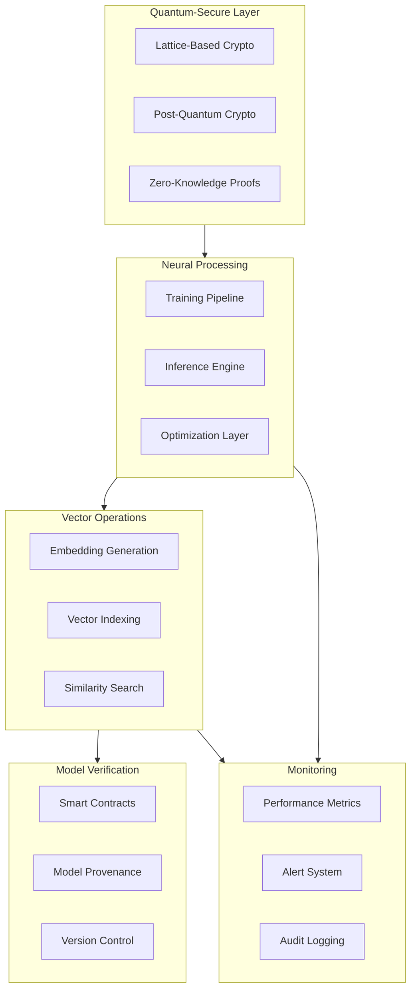

# 241213_TECH_NEURAL_INT_v1.0_ANFL
# Neural Network Integration Architecture
# Security Level: Confidential
# Owner: Infrastructure Team
# Last Modified: 2024-12-13

## BLUF (Bottom Line Up Front)
Comprehensive neural network integration architecture implementing quantum-secure training and inference capabilities, featuring lattice-based cryptography for model protection, and blockchain-based model provenance verification. The system provides enterprise-grade AI capabilities while maintaining strict security and compliance requirements.

## System Architecture

### Core Components Overview



## Implementation Details

### 1. Neural Network Processing Layer
```python
class QuantumSecureNeuralProcessor:
    """
    Neural network processor with quantum security integration
    
    Features:
    - Quantum-resistant model protection
    - Secure training pipeline
    - Protected inference engine
    """
    def __init__(
        self,
        config: NeuralConfig,
        security: SecurityConfig
    ):
        self.quantum_crypto = QuantumCrypto()
        self.training_pipeline = SecureTrainingPipeline()
        self.inference_engine = ProtectedInferenceEngine()
        self.blockchain = ModelVerification()
        
    async def train_model(
        self,
        model: NeuralNetwork,
        data: DataLoader,
        config: TrainingConfig
    ) -> TrainingResult:
        """Execute secure model training"""
        try:
            # Quantum-secure data preparation
            secure_data = await self.quantum_crypto.encrypt_data(data)
            
            # Train with lattice-based protection
            trained_model = await self.training_pipeline.train(
                model=model,
                data=secure_data,
                config=config
            )
            
            # Verify and register model
            model_hash = await self.blockchain.register_model(
                model=trained_model,
                metadata=self.generate_metadata()
            )
            
            return TrainingResult(
                model=trained_model,
                metrics=self.collect_metrics(),
                verification=model_hash
            )
            
        except Exception as e:
            await self.alert_system.raise_alert(
                level="ERROR",
                component="training_pipeline",
                error=e
            )
            raise
```

### 2. Vector Processing Implementation
```yaml
vector_processing:
  embedding_generation:
    model: instructor-xl
    dimension: 3072
    batch_size: 32
    security:
      encryption: lattice_based
      verification: quantum_resistant

  indexing_strategy:
    type: hierarchical
    quantization:
      method: product_quantization
      bits_per_component: 8
    optimization:
      cache_strategy: intelligent_caching
      pruning: dynamic_threshold

  similarity_search:
    algorithm: quantum_resistant_ann
    parameters:
      ef_construction: 400
      ef_search: 100
      m: 16
```

### 3. Blockchain Integration
```solidity
// Neural Network Verification Contract
contract NeuralNetworkVerification {
    struct ModelMetadata {
        bytes32 modelHash;
        bytes32 architectureHash;
        uint256 timestamp;
        address owner;
        string version;
        mapping(string => string) metrics;
    }

    mapping(bytes32 => ModelMetadata) public models;
    
    event ModelVerified(
        bytes32 indexed modelHash,
        address indexed owner,
        string version,
        uint256 timestamp
    );

    function verifyModel(
        bytes32 modelHash,
        bytes32 architectureHash,
        string memory version,
        string[] memory metricKeys,
        string[] memory metricValues
    ) public {
        require(
            metricKeys.length == metricValues.length,
            "Metrics arrays must match"
        );

        ModelMetadata storage metadata = models[modelHash];
        metadata.modelHash = modelHash;
        metadata.architectureHash = architectureHash;
        metadata.timestamp = block.timestamp;
        metadata.owner = msg.sender;
        metadata.version = version;

        for (uint i = 0; i < metricKeys.length; i++) {
            metadata.metrics[metricKeys[i]] = metricValues[i];
        }

        emit ModelVerified(
            modelHash,
            msg.sender,
            version,
            block.timestamp
        );
    }
}
```

## Security Implementation

### 1. Quantum Security Controls
```yaml
quantum_security:
  model_protection:
    encryption:
      algorithm: CRYSTALS-Kyber
      key_rotation: 90d
    signatures:
      algorithm: CRYSTALS-Dilithium
      strength: 5
  
  training_security:
    data_encryption:
      method: homomorphic
      scheme: lattice_based
    gradient_protection:
      method: secure_aggregation
      noise_addition: differential_privacy
```

### 2. Access Control Matrix
```yaml
access_control:
  roles:
    ml_engineer:
      - train_models
      - view_metrics
      - modify_architecture
    ml_ops:
      - deploy_models
      - monitor_performance
      - manage_infrastructure
    security_admin:
      - manage_keys
      - audit_access
      - configure_security

  authentication:
    primary: quantum_resistant_tokens
    secondary: lattice_based_signatures
    mfa: required
```

## Monitoring Implementation

### 1. Performance Metrics
```yaml
metrics_collection:
  training:
    - loss_curves
    - gradient_norms
    - resource_usage
  inference:
    - latency_percentiles
    - throughput
    - error_rates
  security:
    - encryption_overhead
    - verification_time
    - key_rotation_status
```

### 2. Alert Configuration
```yaml
alert_system:
  rules:
    - name: training_anomaly
      condition: loss_spike > threshold
      severity: warning
      channels: [ml_team, security_team]
    
    - name: security_breach
      condition: verification_failure
      severity: critical
      channels: [security_team, management]
    
    - name: performance_degradation
      condition: latency > sla_threshold
      severity: high
      channels: [ml_ops, infrastructure_team]
```

## Version History

| Version | Date | Author | Changes |
|---------|------|--------|---------|
| 1.0 | 2024-12-13 | Infrastructure Team | Initial neural network integration |

## Appendices

### A. Implementation References
- [Neural Network Setup](docs/neural_setup.md)
- [Security Integration](docs/security_integration.md)
- [Monitoring Configuration](docs/monitoring_setup.md)

### B. Security Procedures
- [Key Management](security/key_management.md)
- [Access Control](security/access_control.md)
- [Audit Requirements](security/audit_requirements.md)