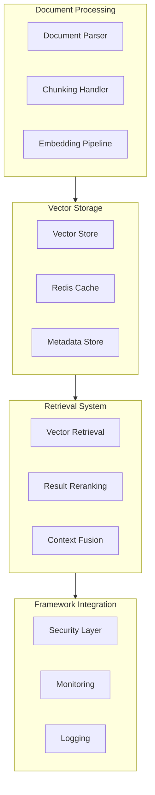

# 241213_TECH_RAG_INT_v1.0_ANFL
# RAG System Design
# Security Level: Confidential
# Owner: Infrastructure Team
# Last Modified: 2024-12-13

## BLUF (Bottom Line Up Front)
Technical design specification for the Retrieval-Augmented Generation (RAG) system integration into the Aeon Nova Framework, focusing on efficient document processing, vector storage, and retrieval optimization while maintaining compliance with existing security and monitoring frameworks.

## System Components

### Architecture Overview



### Implementation Details

1. Document Processing Pipeline
```yaml
document_processing:
  chunking:
    methods:
      - fixed_size:
          size: 512
          overlap: 50
      - semantic:
          method: sentence_transformers
          model: all-MiniLM-L6-v2
  embedding:
    model: instructor-xl
    dimension: 3072
    batch_size: 32
```

2. Vector Store Integration
```yaml
vector_store:
  backend: pinecone
  index_config:
    name: aeon-nova-index
    dimension: 3072
    metric: cosine
    pods: 2
  cache:
    type: redis
    ttl: 3600
    max_size: 10GB
```

3. Retrieval Optimization
```yaml
retrieval:
  search:
    top_k: 5
    score_threshold: 0.7
  reranking:
    method: cross_encoder
    model: cross-encoder/ms-marco-MiniLM-L-6-v2
  context_fusion:
    max_tokens: 4096
    strategy: semantic_merge
```

## Security Integration

### Authentication & Authorization
```yaml
auth_config:
  vault_integration:
    auth_method: approle
    policies:
      - rag-system-policy
      - vector-store-policy
  rbac:
    roles:
      - rag_admin
      - rag_user
      - rag_readonly
```

### Data Protection
```yaml
data_protection:
  encryption:
    at_rest:
      method: AES-256-GCM
      key_rotation: 90d
    in_transit:
      method: TLS 1.3
      cert_management: ACM
  access_control:
    document_level:
      classification: mandatory
      audit: enabled
```

## Monitoring Integration

### Metrics Collection
```yaml
metrics:
  prometheus:
    collectors:
      - name: document_processing_duration
        type: histogram
        labels: [doc_type, chunk_method]
      - name: embedding_generation_time
        type: histogram
        labels: [model, batch_size]
      - name: vector_search_latency
        type: histogram
        labels: [index, query_type]
```

### Alert Configuration
```yaml
alerts:
  rules:
    - name: high_processing_latency
      expr: histogram_quantile(0.95, document_processing_duration) > 30
      for: 5m
      severity: warning
    - name: embedding_failure_rate
      expr: rate(embedding_failures_total[5m]) > 0.01
      for: 5m
      severity: critical
```

## Error Handling

### Error Categories
1. Document Processing Errors
   - Invalid document format
   - Chunking failures
   - Embedding generation failures

2. Vector Store Errors
   - Index operation failures
   - Cache inconsistencies
   - Query timeouts

### Recovery Procedures
```yaml
error_handling:
  retry_policy:
    max_attempts: 3
    backoff:
      initial: 1s
      multiplier: 2
      max: 10s
  circuit_breaker:
    failure_threshold: 5
    reset_timeout: 30s
```

## Version History

| Version | Date | Author | Changes |
|---------|------|--------|---------|
| 1.0 | 2024-12-13 | Infrastructure Team | Initial RAG system design |

## Appendices

### A. Configuration Templates
- [Vector Store Config](templates/vector_store_config.yml)
- [Document Processing Config](templates/doc_processing_config.yml)
- [Monitoring Rules](templates/monitoring_rules.yml)

### B. Implementation Guidelines
- [Security Integration Guide](guides/security_integration.md)
- [Monitoring Setup](guides/monitoring_setup.md)
- [Error Handling Procedures](guides/error_handling.md)
