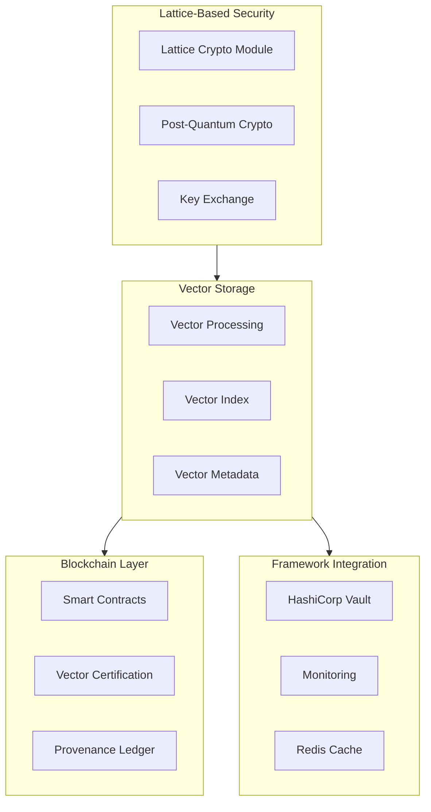

# 241213_TECH_VECTOR_INT_v1.0_ANFL
# Vector Store Integration with Lattice and Blockchain Support
# Security Level: Confidential
# Owner: Infrastructure Team
# Last Modified: 2024-12-13

## BLUF (Bottom Line Up Front)
Technical specification for the Vector Store implementation utilizing lattice-based cryptography for post-quantum security and blockchain integration for immutable vector provenance, while maintaining compliance with the Aeon Nova Framework standards.

## System Architecture

### Component Overview



### Lattice-Based Implementation

1. Cryptographic Framework
```yaml
lattice_crypto:
  algorithm: CRYSTALS-Kyber
  parameters:
    security_level: 5  # Post-quantum security level
    dimension: 3072
    modulus: "q=3329"
  key_exchange:
    protocol: LWE-Based
    refresh_interval: 24h
```

2. Vector Processing
```yaml
vector_processing:
  encryption:
    method: lattice_based
    scheme: BGV  # Brakerski-Gentry-Vaikuntanathan
  operations:
    similarity:
      metric: cosine
      optimization: approximate_nearest_neighbor
    compression:
      method: product_quantization
      subspace_bits: 8
```

### Blockchain Integration

1. Smart Contract Architecture
```solidity
// Vector Provenance Contract
contract VectorProvenance {
    struct VectorMetadata {
        bytes32 vectorHash;
        uint256 timestamp;
        address owner;
        string modelVersion;
    }

    mapping(bytes32 => VectorMetadata) public vectors;
    
    event VectorRegistered(
        bytes32 indexed vectorHash,
        address indexed owner,
        uint256 timestamp
    );

    function registerVector(
        bytes32 vectorHash,
        string memory modelVersion
    ) public {
        vectors[vectorHash] = VectorMetadata({
            vectorHash: vectorHash,
            timestamp: block.timestamp,
            owner: msg.sender,
            modelVersion: modelVersion
        });
        
        emit VectorRegistered(
            vectorHash,
            msg.sender,
            block.timestamp
        );
    }
}
```

2. Vector Certification
```yaml
certification:
  blockchain: ethereum
  network: private_chain
  contracts:
    provenance: VectorProvenance
    certification: VectorCertification
  gas_optimization:
    batch_size: 100
    priority: medium
```

## Implementation Details

### Vector Store Configuration
```yaml
vector_store:
  backend:
    type: distributed_index
    sharding:
      method: consistent_hashing
      shards: 32
  storage:
    primary: s3
    cache: redis
    metadata: dynamodb
  encryption:
    lattice_scheme: BGV
    key_rotation: 90d
```

### Blockchain Integration
```yaml
blockchain_config:
  network:
    type: private_ethereum
    consensus: proof_of_authority
  smart_contracts:
    deployment:
      automation: true
      gas_strategy: economic
    monitoring:
      events: true
      metrics: true
```

## Security Implementation

### Post-Quantum Security
```yaml
pq_security:
  algorithms:
    - CRYSTALS-Kyber  # Key encapsulation
    - CRYSTALS-Dilithium  # Digital signatures
    - FALCON  # Alternative signature scheme
  implementation:
    libraries:
      - liboqs
      - pqlattice
    integration:
      - vault_pq_plugin
      - tls_pq_hybrid
```

### Access Control
```yaml
access_control:
  authentication:
    primary: vault_approle
    quantum_resistant: true
  authorization:
    model: rbac
    blockchain_validation: true
```

## Monitoring Integration

### Metrics Collection
```yaml
metrics:
  vector_operations:
    - latency_quantiles
    - throughput
    - error_rate
  blockchain:
    - gas_usage
    - contract_calls
    - event_emissions
  lattice_crypto:
    - key_generation_time
    - encryption_performance
    - decryption_performance
```

### Alerting Configuration
```yaml
alerts:
  rules:
    - name: high_vector_latency
      expr: vector_operation_duration > 100ms
      for: 5m
      severity: warning
    - name: blockchain_sync_delay
      expr: blockchain_sync_lag > 10
      for: 5m
      severity: critical
```

## Version History

| Version | Date | Author | Changes |
|---------|------|--------|---------|
| 1.0 | 2024-12-13 | Infrastructure Team | Initial vector store design with lattice and blockchain support |

## Appendices

### A. Implementation References
- [Lattice Cryptography Setup](docs/lattice_crypto.md)
- [Blockchain Integration](docs/blockchain_setup.md)
- [Vector Store Configuration](docs/vector_store.md)

### B. Security Protocols
- [Post-Quantum Security Guide](security/pq_security.md)
- [Smart Contract Audit Procedures](security/smart_contract_audit.md)
- [Vector Provenance Verification](security/vector_provenance.md)