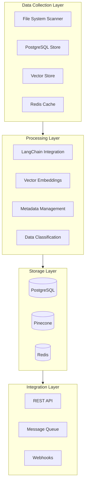

# 241214_PLAN_DATA_PROC_INT_v1.0_ANFL
# Data Processing Implementation Plan
# Security Level: Internal
# Owner: Infrastructure Team

## System Architecture



## Phase 1: Database Setup and Integration

### PostgreSQL Schema
```sql
-- Core data management schema
CREATE SCHEMA IF NOT EXISTS aeon_nova;

-- File metadata tracking
CREATE TABLE aeon_nova.file_metadata (
    id UUID PRIMARY KEY DEFAULT gen_random_uuid(),
    file_path TEXT NOT NULL,
    file_type VARCHAR(50),
    file_size BIGINT,
    checksum VARCHAR(64),
    created_at TIMESTAMP WITH TIME ZONE DEFAULT CURRENT_TIMESTAMP,
    last_processed TIMESTAMP WITH TIME ZONE,
    processing_status VARCHAR(20),
    metadata JSONB
);

-- Vector mappings
CREATE TABLE aeon_nova.vector_mappings (
    id UUID PRIMARY KEY DEFAULT gen_random_uuid(),
    file_id UUID REFERENCES aeon_nova.file_metadata(id),
    vector_id VARCHAR(255),
    embedding_model VARCHAR(100),
    embedding_dim INTEGER,
    created_at TIMESTAMP WITH TIME ZONE DEFAULT CURRENT_TIMESTAMP,
    CONSTRAINT unique_vector_id UNIQUE (vector_id)
);

-- Processing history
CREATE TABLE aeon_nova.processing_history (
    id UUID PRIMARY KEY DEFAULT gen_random_uuid(),
    file_id UUID REFERENCES aeon_nova.file_metadata(id),
    process_type VARCHAR(50),
    status VARCHAR(20),
    start_time TIMESTAMP WITH TIME ZONE DEFAULT CURRENT_TIMESTAMP,
    end_time TIMESTAMP WITH TIME ZONE,
    error_message TEXT
);
```

## Phase 2: LangChain Integration

### Configuration
```yaml
langchain_integration:
  embeddings:
    default_model: "text-embedding-ada-002"
    batch_size: 100
    cache_enabled: true
    
  document_loaders:
    supported_types:
      - text/markdown
      - application/json
      - text/yaml
      - text/python
    
  vector_store:
    primary: pinecone
    cache: redis
    dimensions: 1536
    metric: cosine

  processing_pipeline:
    - text_splitter:
        chunk_size: 1000
        chunk_overlap: 200
    - embeddings_generator:
        model: ${embeddings.default_model}
        batch_size: ${embeddings.batch_size}
    - vector_store:
        store: ${vector_store.primary}
        namespace: "aeon-nova"
```

## Phase 3: Processing Pipeline Implementation

### Metadata Collection Pipeline
```python
class MetadataProcessor:
    """Framework-compliant metadata processor"""
    
    def __init__(self, db_manager, vector_store):
        self.db = db_manager
        self.vector_store = vector_store
        self.embeddings = OpenAIEmbeddings()
        
    async def process_file(self, file_path: str) -> dict:
        """Process a single file and store metadata"""
        try:
            # Extract metadata
            metadata = await self.extract_metadata(file_path)
            
            # Store in PostgreSQL
            file_id = await self.db.store_metadata(metadata)
            
            # Generate embeddings
            if self.should_vectorize(metadata['file_type']):
                vector_id = await self.vectorize_content(
                    file_path, 
                    metadata
                )
                await self.db.update_vector_mapping(
                    file_id, 
                    vector_id
                )
            
            return {
                'file_id': file_id,
                'status': 'success',
                'vector_id': vector_id
            }
            
        except Exception as e:
            await self.db.log_error(file_path, str(e))
            raise
```

## Success Metrics and Monitoring

```yaml
metrics:
  performance:
    processing_rate: "files/second"
    embedding_generation: "vectors/second"
    database_latency: "ms"
    
  quality:
    metadata_completeness: percentage
    vectorization_success_rate: percentage
    error_rate: percentage
    
  storage:
    postgresql_usage: GB
    vector_store_usage: GB
    cache_hit_rate: percentage
```

## Implementation Timeline

1. Week 1: Database Setup
   - PostgreSQL schema creation
   - Initial indexing strategy
   - Basic metadata collection

2. Week 2: LangChain Integration
   - Vector embedding pipeline
   - Document processing setup
   - Cache configuration

3. Week 3: Pipeline Development
   - Full processing pipeline
   - Error handling
   - Monitoring implementation

4. Week 4: Testing and Optimization
   - Performance testing
   - Resource optimization
   - Documentation updates

## Next Steps

1. Initialize PostgreSQL schema with proper indexes
2. Configure LangChain embedding pipeline
3. Set up monitoring dashboards
4. Begin incremental data processing
