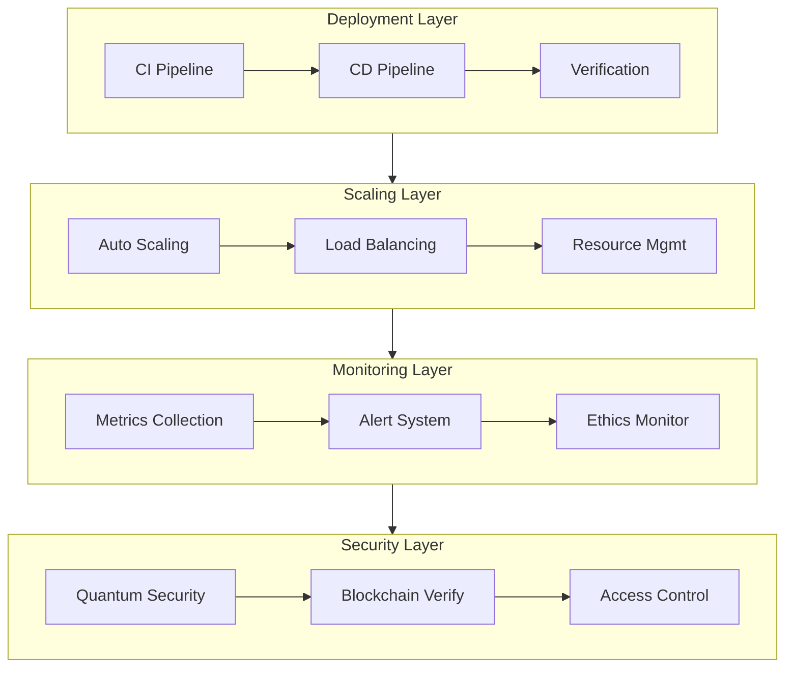

# 241116_OPS_DEPLOY_INT_v1.0_ANFL

## BLUF (Bottom Line Up Front)
Unified operations framework integrating deployment, scaling, and monitoring systems with quantum-secure infrastructure and ethical AI governance. Provides automated scaling, comprehensive monitoring, and robust failover capabilities while maintaining security and compliance standards.

## 1. System Overview

### 1.1 Operations Pipeline


### 1.2 CI/CD Implementation
```python
class DeploymentOrchestrator:
    """
    Manages deployment operations across all environments
    """
    def __init__(self):
        self.ci_pipeline = CIPipeline()
        self.cd_pipeline = CDPipeline()
        self.security = SecurityValidator()
        self.ethics = EthicsValidator()
        
    async def deploy(
        self,
        version: str,
        environment: str,
        config: Dict
    ) -> DeploymentResult:
        """Execute secure deployment process"""
        try:
            # Security and ethics validation
            if not await self.security.validate_deployment(version):
                return DeploymentResult(success=False, reason="Security validation failed")
                
            if not await self.ethics.validate_deployment(version):
                return DeploymentResult(success=False, reason="Ethics validation failed")
            
            # Build and verify
            artifact = await self.ci_pipeline.build(version)
            
            # Deploy with verification
            result = await self.cd_pipeline.deploy(
                artifact,
                environment,
                config
            )
            
            # Post-deployment verification
            await self.verify_deployment(result)
            
            return result
            
        except Exception as e:
            await self.handle_deployment_failure(e)
            raise
```

## 2. Scaling Operations

### 2.1 Auto-Scaling System
```python
class ScalingManager:
    """
    Handles dynamic resource scaling and optimization
    """
    def __init__(self):
        self.monitor = MetricsMonitor()
        self.resource_manager = ResourceManager()
        self.cost_optimizer = CostOptimizer()
        
    async def manage_scaling(self, metrics: Dict[str, float]):
        """Manage automatic scaling based on system metrics"""
        # Analyze metrics
        scaling_decisions = self.analyze_metrics(metrics)
        
        # Apply scaling decisions
        for service, decision in scaling_decisions.items():
            await self.scale_service(service, decision)
            
        # Verify scaling effects
        await self.verify_scaling()
```

### 2.2 Resource Management
```python
class ResourceManager:
    """
    Manages compute resources and optimization
    """
    async def allocate_resources(
        self,
        service: str,
        requirements: Dict
    ) -> AllocationResult:
        """Allocate resources based on service requirements"""
        try:
            # Verify resource availability
            if not await self.check_resources(requirements):
                return AllocationResult(
                    success=False,
                    reason="Insufficient resources"
                )
                
            # Allocate resources
            allocation = await self.orchestrator.allocate(
                service=service,
                resources=requirements
            )
            
            # Verify allocation
            await self.verify_allocation(allocation)
            
            return AllocationResult(
                success=True,
                allocation=allocation
            )
            
        except Exception as e:
            await self.handle_allocation_failure(e)
            raise
```

## 3. Monitoring System

### 3.1 Metrics Collection
```python
class MetricsCollector:
    """
    Collects and processes system metrics
    """
    def __init__(self):
        self.collectors = {
            'system': SystemMetricsCollector(),
            'security': SecurityMetricsCollector(),
            'ethics': EthicsMetricsCollector(),
            'performance': PerformanceMetricsCollector()
        }
        
    async def collect_all(self) -> MetricsBundle:
        """Collect all system metrics"""
        metrics = {}
        for name, collector in self.collectors.items():
            metrics[name] = await collector.collect()
            
        return MetricsBundle(
            timestamp=datetime.now(),
            metrics=metrics
        )
```

### 3.2 Alert System
```python
class AlertManager:
    """
    Manages system alerts and notifications
    """
    async def process_alert(
        self,
        alert: Alert
    ) -> AlertResponse:
        """Process and route system alerts"""
        # Validate alert
        if not self.validate_alert(alert):
            return AlertResponse(processed=False, reason="Invalid alert")
            
        # Check severity and route
        if alert.severity >= AlertSeverity.HIGH:
            await self.trigger_immediate_response(alert)
        else:
            await self.queue_alert(alert)
            
        return AlertResponse(processed=True)
```

## 4. Security Integration

### 4.1 Deployment Security
```python
class SecurityValidator:
    """
    Validates deployment security
    """
    async def validate_deployment(
        self,
        deployment: Deployment
    ) -> ValidationResult:
        """Validate deployment security requirements"""
        checks = {
            'quantum_security': self.check_quantum_security(),
            'blockchain_verify': self.verify_blockchain(),
            'ethics_compliance': self.check_ethics(),
            'access_control': self.verify_access()
        }
        
        results = await asyncio.gather(*checks.values())
        
        return ValidationResult(
            valid=all(results),
            details=dict(zip(checks.keys(), results))
        )
```

### 4.2 Runtime Security
```python
class RuntimeSecurity:
    """
    Manages runtime security monitoring
    """
    async def monitor_security(self) -> SecurityStatus:
        """Monitor runtime security metrics"""
        metrics = {
            'quantum_status': self.check_quantum_status(),
            'blockchain_health': self.check_blockchain(),
            'ethics_compliance': self.check_ethics_status(),
            'access_logs': self.audit_access()
        }
        
        results = await asyncio.gather(*metrics.values())
        
        return SecurityStatus(
            secure=all(r.secure for r in results),
            metrics=dict(zip(metrics.keys(), results))
        )
```

## 5. Recovery and Failover

### 5.1 Recovery Procedures
```python
class RecoveryManager:
    """
    Manages system recovery and failover
    """
    async def handle_failure(
        self,
        incident: Incident
    ) -> RecoveryResult:
        """Handle system failures and initiate recovery"""
        # Log incident
        await self.log_incident(incident)
        
        # Determine recovery strategy
        strategy = self.determine_strategy(incident)
        
        # Execute recovery
        result = await self.execute_recovery(strategy)
        
        # Verify recovery
        if not await self.verify_recovery(result):
            await self.escalate_incident(incident)
            
        return result
```

### 5.2 Failover Systems
```python
class FailoverManager:
    """
    Manages system failover operations
    """
    async def initiate_failover(
        self,
        service: str,
        region: str
    ) -> FailoverResult:
        """Handle service failover"""
        try:
            # Disable primary
            await self.disable_primary(service, region)
            
            # Activate backup
            await self.activate_backup(service, region)
            
            # Update routing
            await self.update_routing(service)
            
            # Verify failover
            if not await self.verify_failover(service):
                await self.rollback_failover(service, region)
                
            return FailoverResult(success=True)
            
        except Exception as e:
            await self.handle_failover_error(e)
            raise
```

## Version History

| Version | Date | Changes |
|---------|------|---------|
| 1.0.0 | 2024-11-16 | Initial unified operations framework |

## Next Steps

### 6.1 Immediate Implementation
1. Deploy core operations framework
2. Enable auto-scaling
3. Implement security validation
4. Launch monitoring system

### 6.2 Future Enhancements
1. Advanced failover capabilities
2. Enhanced cost optimization
3. Predictive scaling
4. Global deployment support