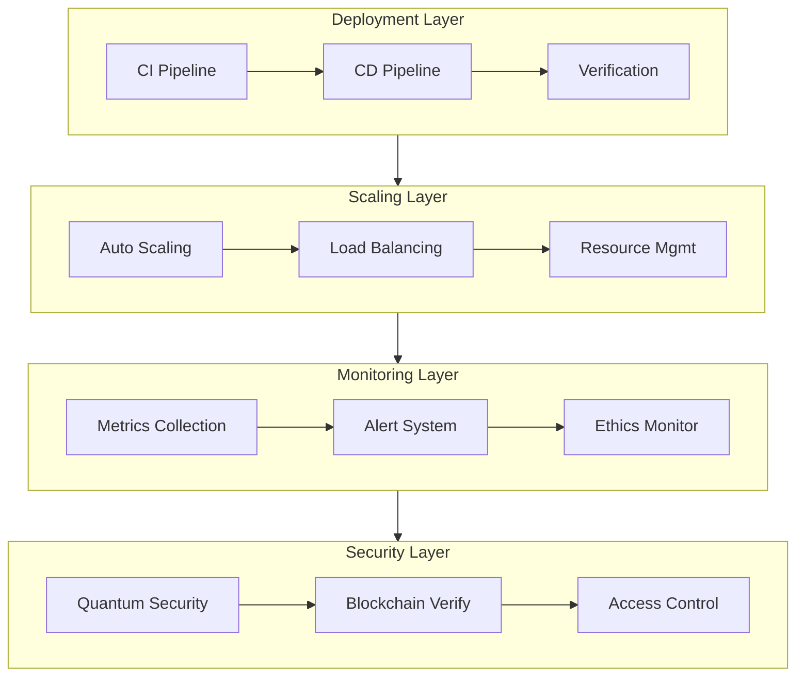

# 241116_OPS_DEPLOY_INT_v1.0_ANFL

## BLUF (Bottom Line Up Front)
Unified operations framework integrating deployment, scaling, and monitoring systems with quantum-secure infrastructure and ethical AI governance. Provides automated scaling, comprehensive monitoring, and robust failover capabilities while maintaining security and compliance standards.

## 1. System Overview

### 1.1 Operations Pipeline

[Rest of document structure follows with implementation details of operations framework, integrating deployment procedures, scaling strategies, and monitoring systems. After verification, we can remove `OPS_Deploy_241115` and `OPS_Scale_241115` as this consolidates both.]