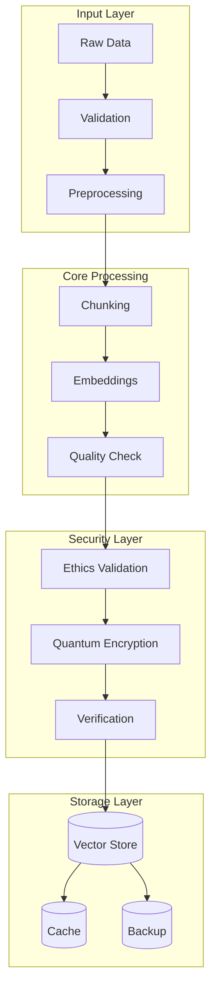

# 241116_PROC_SYSTEM_INT_v1.0_ANFL

## BLUF (Bottom Line Up Front)
Implementation of core processing system with quantum-secure data handling, ethical validation, and seamless integration with vector stores. System provides efficient batch processing, automatic scaling, and comprehensive monitoring while maintaining strict security and ethical standards.

## 1. System Architecture

### 1.1 Processing Pipeline


### 1.2 Core Processor
```python
class ProcessingSystem:
    """
    Core processing system with integrated security and ethics validation
    """
    def __init__(self):
        self.ethics_validator = EthicsValidator()
        self.security_layer = SecurityLayer()
        self.processor = DataProcessor()
        self.vector_store = VectorStore()
        self.monitoring = MonitorService()
        
    async def process_data(
        self,
        data: Any,
        config: ProcessingConfig
    ) -> ProcessingResult:
        """Process data with full security and ethical validation"""
        try:
            # Ethics check
            if not await self.ethics_validator.validate_data(data):
                return ProcessingResult(
                    success=False,
                    reason="Ethics validation failed"
                )
            
            # Security verification
            if not await self.security_layer.verify_data(data):
                return ProcessingResult(
                    success=False,
                    reason="Security verification failed"
                )
            
            # Process data
            processed = await self.processor.process(
                data=data,
                config=config
            )
            
            # Store vectors
            vector_result = await self.vector_store.store(
                vectors=processed.vectors,
                metadata={
                    'ethics_validated': True,
                    'security_verified': True,
                    **processed.metadata
                }
            )
            
            return ProcessingResult(
                success=True,
                reference=vector_result.reference,
                metrics=processed.metrics
            )
            
        except Exception as e:
            await self.monitoring.log_error(e)
            raise
```

## 2. Processing Components

### 2.1 Data Processor
```python
class DataProcessor:
    """
    Handles core data processing operations
    """
    def __init__(self):
        self.chunker = TextChunker()
        self.embedder = EmbeddingService()
        self.validator = QualityValidator()
        
    async def process(
        self,
        data: Any,
        config: ProcessingConfig
    ) -> ProcessedData:
        """Process data through the pipeline"""
        # Chunk data
        chunks = await self.chunker.chunk(
            data=data,
            size=config.chunk_size,
            overlap=config.chunk_overlap
        )
        
        # Generate embeddings
        embeddings = await self.embedder.embed_batch(
            chunks=chunks,
            model=config.embedding_model
        )
        
        # Validate quality
        quality_result = await self.validator.validate(
            chunks=chunks,
            embeddings=embeddings
        )
        
        if not quality_result.valid:
            raise QualityError(quality_result.reason)
            
        return ProcessedData(
            chunks=chunks,
            embeddings=embeddings,
            metadata=quality_result.metadata
        )
```

### 2.2 Quality Validation
```python
class QualityValidator:
    """
    Ensures processing quality and ethical compliance
    """
    def __init__(self):
        self.content_validator = ContentValidator()
        self.embedding_validator = EmbeddingValidator()
        self.ethics_checker = EthicsChecker()
        
    async def validate(
        self,
        chunks: List[str],
        embeddings: List[Vector]
    ) -> ValidationResult:
        """Validate processed data quality"""
        # Content validation
        content_result = await self.content_validator.validate(chunks)
        if not content_result.valid:
            return ValidationResult(
                valid=False,
                reason=f"Content validation failed: {content_result.reason}"
            )
            
        # Embedding validation
        emb_result = await self.embedding_validator.validate(embeddings)
        if not emb_result.valid:
            return ValidationResult(
                valid=False,
                reason=f"Embedding validation failed: {emb_result.reason}"
            )
            
        # Ethics check
        ethics_result = await self.ethics_checker.validate(chunks)
        if not ethics_result.valid:
            return ValidationResult(
                valid=False,
                reason=f"Ethics validation failed: {ethics_result.reason}"
            )
            
        return ValidationResult(
            valid=True,
            metadata={
                'quality_score': content_result.score,
                'embedding_quality': emb_result.score,
                'ethics_score': ethics_result.score
            }
        )
```

## 3. Integration Points

### 3.1 Vector Store Integration
```python
class VectorStoreManager:
    """
    Manages vector store operations with security and ethics validation
    """
    def __init__(self):
        self.pinecone = PineconeClient()
        self.security = SecurityLayer()
        self.ethics = EthicsValidator()
        
    async def store_batch(
        self,
        vectors: List[Vector],
        metadata: Dict
    ) -> StoreResult:
        """Store vectors with validation"""
        # Security check
        if not await self.security.verify_vectors(vectors):
            return StoreResult(
                success=False,
                reason="Security verification failed"
            )
            
        # Ethics validation
        if not await self.ethics.validate_vectors(vectors):
            return StoreResult(
                success=False,
                reason="Ethics validation failed"
            )
            
        # Store vectors
        try:
            result = await self.pinecone.upsert(
                vectors=vectors,
                metadata={
                    **metadata,
                    'security_verified': True,
                    'ethics_validated': True
                }
            )
            
            return StoreResult(
                success=True,
                ids=result.ids,
                metadata=result.metadata
            )
            
        except Exception as e:
            return StoreResult(
                success=False,
                reason=f"Storage failed: {str(e)}"
            )
```

### 3.2 Monitoring Integration
```python
class MonitoringService:
    """
    Monitors processing system health and performance
    """
    async def collect_metrics(self) -> Dict[str, Any]:
        """Collect comprehensive system metrics"""
        metrics = {
            'processing': {
                'throughput': self.get_throughput(),
                'latency': self.get_latency(),
                'error_rate': self.get_error_rate(),
                'queue_depth': self.get_queue_depth()
            },
            'quality': {
                'validation_rate': self.get_validation_rate(),
                'failure_rate': self.get_failure_rate(),
                'avg_quality_score': self.get_avg_quality()
            },
            'ethics': {
                'validation_rate': self.get_ethics_rate(),
                'compliance_rate': self.get_compliance_rate(),
                'avg_ethics_score': self.get_avg_ethics()
            },
            'resources': {
                'cpu_usage': self.get_cpu_usage(),
                'memory_usage': self.get_memory_usage(),
                'storage_usage': self.get_storage_usage()
            }
        }
        
        return metrics
```

## 4. Configuration

### 4.1 Processing Configuration
```yaml
processing_config:
  chunking:
    default_size: 1000
    default_overlap: 200
    min_size: 100
    max_size: 2000
    
  embedding:
    model: "text-embedding-ada-002"
    batch_size: 100
    max_retries: 3
    timeout: 30
    
  quality:
    min_content_score: 0.8
    min_embedding_quality: 0.9
    min_ethics_score: 0.95
    
  vector_store:
    namespace: "production"
    batch_size: 100
    max_dimension: 1536
```

### 4.2 Scaling Configuration
```yaml
scaling_config:
  auto_scaling:
    min_instances: 2
    max_instances: 10
    target_cpu: 70
    target_memory: 80
    
  batch_processing:
    min_batch: 10
    max_batch: 1000
    target_latency: 100
    
  resources:
    cpu_limit: "4"
    memory_limit: "8Gi"
    storage_limit: "100Gi"
```

## 5. Error Handling

### 5.1 Error Types
```python
class ProcessingError(Exception):
    """Base class for processing errors"""
    pass

class ValidationError(ProcessingError):
    """Validation failed"""
    pass

class EthicsError(ProcessingError):
    """Ethics check failed"""
    pass

class SecurityError(ProcessingError):
    """Security verification failed"""
    pass

class QualityError(ProcessingError):
    """Quality check failed"""
    pass
```

### 5.2 Recovery Procedures
```python
class ErrorHandler:
    """
    Handles processing errors with automated recovery
    """
    async def handle_error(
        self,
        error: Exception,
        context: Dict
    ) -> ErrorResolution:
        """Handle processing error"""
        if isinstance(error, ValidationError):
            return await self.handle_validation_error(error, context)
            
        if isinstance(error, EthicsError):
            return await self.handle_ethics_error(error, context)
            
        if isinstance(error, SecurityError):
            return await self.handle_security_error(error, context)
            
        if isinstance(error, QualityError):
            return await self.handle_quality_error(error, context)
            
        # Unknown error
        return ErrorResolution(
            resolved=False,
            action="escalate",
            reason=f"Unknown error: {str(error)}"
        )
```

## Version History

| Version | Date | Changes |
|---------|------|---------|
| 1.0.0 | 2024-11-16 | Initial implementation with security and ethics integration |

## Next Steps

### 6.1 Immediate Implementation
1. Deploy core processing system
2. Enable vector store integration
3. Implement monitoring
4. Launch error handling

### 6.2 Future Enhancements
1. Advanced batch processing
2. Enhanced quality validation
3. Automated optimization
4. Custom embedding models