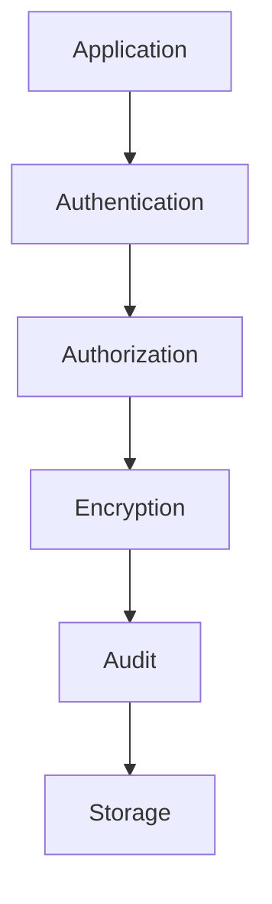
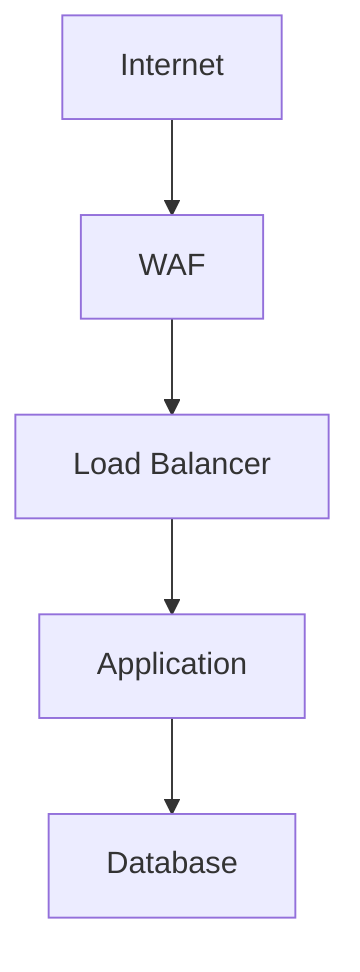

# ----------------------------------------------------------------------------
# File: 250208_SEC_GUIDE_INT_v1.0_ANFL.md
# Location: /Volumes/mattstack/VSCode/AeonNovaFutureLabs/docs/security/
#
# Purpose: Security guidelines and protocols documentation
# Security Level: Confidential
# Owner: Infrastructure Team
# Version: 1.0
# Last Modified: 2025-02-08
#
# References:
# - 250208_ARCH_OVERVIEW_INT_v1.0_ANFL.md
# - 250208_SECURITY_INT_v1.0_ANFL.zsh
# ----------------------------------------------------------------------------

# BLUF: Security guidelines and protocols for ANFL framework

## Security Architecture

### 1. Core Principles
- Zero-trust architecture
- Defense in depth
- Least privilege
- Secure by default
- Comprehensive auditing

### 2. Security Layers


## Access Control

### 1. Authentication
- Multi-factor authentication
- Token-based access
- Session management
- Secure password policies

### 2. Authorization
- Role-based access control
- Permission management
- Access policies
- Resource isolation

### 3. Vault Integration
```bash
# Initialize Vault
init_vault

# Unseal Vault
unseal_vault

# Manage secrets
vault_write secret/api-keys key=value
vault_read secret/api-keys
```

## Data Security

### 1. Encryption
- At-rest encryption
- In-transit encryption
- Key management
- Secure key rotation

### 2. Data Classification
- Public
- Internal
- Confidential
- Restricted

### 3. Data Handling
```python
def handle_sensitive_data(data: Dict[str, Any]) -> None:
    # Validate classification
    validate_classification(data)
    
    # Encrypt sensitive fields
    encrypt_fields(data)
    
    # Store securely
    secure_store(data)
    
    # Audit access
    audit_access(data)
```

## Network Security

### 1. Network Architecture


### 2. Security Controls
- Firewall rules
- Network segmentation
- Traffic monitoring
- DDoS protection

### 3. Communication
- TLS 1.3+
- Certificate management
- Secure protocols
- Traffic encryption

## Monitoring & Auditing

### 1. Security Monitoring
```bash
# Check security status
anfl-secure

# View security logs
anfl-logs security

# Monitor alerts
anfl-monitor security
```

### 2. Audit Logging
- Access logs
- Change logs
- Security events
- System logs

### 3. Alerts
- Security incidents
- Policy violations
- System anomalies
- Access attempts

## Development Security

### 1. Secure Coding
- Input validation
- Output encoding
- Error handling
- Secure defaults

### 2. Code Review
```python
# Security checklist
def security_review():
    # Check input validation
    verify_input_validation()
    
    # Check authentication
    verify_authentication()
    
    # Check authorization
    verify_authorization()
    
    # Check data handling
    verify_data_handling()
```

### 3. Testing
- Security testing
- Penetration testing
- Vulnerability scanning
- Dependency checks

## Incident Response

### 1. Response Plan
1. Detection
2. Analysis
3. Containment
4. Eradication
5. Recovery
6. Lessons learned

### 2. Response Team
- Security team
- Infrastructure team
- Development team
- Management team

### 3. Communication
- Internal communication
- External communication
- Status updates
- Post-mortem reports

## Compliance

### 1. Standards
- Industry standards
- Security frameworks
- Best practices
- Compliance requirements

### 2. Policies
- Security policies
- Access policies
- Data policies
- Network policies

### 3. Auditing
- Regular audits
- Compliance checks
- Policy reviews
- Security assessments

## Best Practices

### 1. Development
- Secure coding
- Code review
- Security testing
- Dependency management

### 2. Operations
- Access control
- Monitoring
- Incident response
- Change management

### 3. Infrastructure
- Network security
- System hardening
- Patch management
- Backup strategy

## References

### Documentation
- Architecture Guide
- Development Guide
- Operations Guide
- Compliance Guide

### Tools
- Security Tools
- Monitoring System
- Audit System
- Response Tools

## Support

For security issues:
1. Check documentation
2. Review security logs
3. Contact security team

## License
Confidential and proprietary. All rights reserved.

---
© 2025 Aeon Nova Future Labs. All rights reserved.